# AI Resource Manager v2 — Master Blueprint

> **Version:** 3.0.0  
> **Status:** Active  
> **Last Updated:** 2026-09-09  
> **Classification:** Internal Architecture Document  
> **Intended Audience:** AI Coding Agent, Lead Developer

---

## Table of Contents

1. [Executive Summary](#1-executive-summary)
2. [Vision](#2-vision)
3. [Goals](#3-goals)
4. [Scope](#4-scope)
5. [Design Philosophy](#5-design-philosophy)
6. [Technology Stack](#6-technology-stack)
7. [Architecture Overview](#7-architecture-overview)
8. [Electron Architecture](#8-electron-architecture)
9. [React Architecture](#9-react-architecture)
10. [Database Architecture](#10-database-architecture)
11. [Folder Structure](#11-folder-structure)
12. [Feature Modules](#12-feature-modules)
13. [Entity System](#13-entity-system)
14. [Generic CRUD Strategy](#14-generic-crud-strategy)
15. [Autocomplete System](#15-autocomplete-system)
16. [Generic Form Engine](#16-generic-form-engine)
17. [Dashboard](#17-dashboard)
18. [Agents](#18-agents)
19. [Providers](#19-providers)
20. [Models](#20-models)
21. [Accounts](#21-accounts)
22. [API Keys](#22-api-keys)
23. [Projects](#23-projects)
24. [Notes](#24-notes)
25. [Tags](#25-tags)
26. [Activity History](#26-activity-history)
27. [Reset Dates and Quotas](#27-reset-dates-and-quotas)
28. [Analytics](#28-analytics)
29. [Search System](#29-search-system)
30. [Command Palette](#30-command-palette)
31. [Navigation and Routing](#31-navigation-and-routing)
32. [State Management](#32-state-management)
33. [Repositories](#33-repositories)
34. [Services](#34-services)
35. [Shared Hooks](#35-shared-hooks)
36. [Shared Components](#36-shared-components)
37. [Shared Tables](#37-shared-tables)
38. [Shared Dialogs](#38-shared-dialogs)
39. [Widgets](#39-widgets)
40. [Charts](#40-charts)
41. [Theme System](#41-theme-system)
42. [Design Tokens](#42-design-tokens)
43. [Animations](#43-animations)
44. [Accessibility](#44-accessibility)
45. [Performance](#45-performance)
46. [Security](#46-security)
47. [SQLite Optimization](#47-sqlite-optimization)
48. [Keyboard Shortcuts](#48-keyboard-shortcuts)
49. [Import and Export](#49-import-and-export)
50. [Backup and Restore](#50-backup-and-restore)
51. [Notifications](#51-notifications)
52. [Settings](#52-settings)
53. [Optional Modules](#53-optional-modules)
54. [Productivity Features](#54-productivity-features)
55. [Coding Standards](#55-coding-standards)
56. [Testing Strategy](#56-testing-strategy)
57. [Migration Strategy](#57-migration-strategy)
58. [Development Phases](#58-development-phases)
59. [Implementation Roadmap](#59-implementation-roadmap)
60. [Future Roadmap](#60-future-roadmap)
61. [Risk Assessment](#61-risk-assessment)
62. [Developer Experience](#62-developer-experience)
63. [Acceptance Criteria](#63-acceptance-criteria)
64. [Final Checklist](#64-final-checklist)
65. [Appendices](#65-appendices)

---

## 1. Executive Summary

**AI Resource Manager v2** is a premium, offline-first desktop application for personal management of all AI-related resources. It provides a unified interface to manage AI Agents, Accounts, Providers, Models, Projects, API Keys, Notes, Tags, and more — all backed by a local SQLite database.

**Core Principles:**

- **Offline-first:** SQLite is the single source of truth. No cloud dependency.
- **Database-driven:** Zero hardcoded values. Every entity is creatable from the UI.
- **Keyboard-first:** Every action accessible via keyboard. Command palette for power users.
- **Premium feel:** Inspired by Linear, Raycast, Cursor, Arc Browser, and Notion.
- **Simple architecture:** 2-layer renderer stack, generic systems, minimal abstraction.

**Technology:** Electron 44, React 19, Vite 8, Tailwind CSS v4, shadcn/ui (base-nova), Zustand, TanStack Query, TanStack Table, TanStack Virtual, React Hook Form, Zod, Recharts, better-sqlite3, Lucide, Motion.

**Target:** Single-user personal tool. No SaaS. No multi-user. No cloud-first.

**Scope:** 12 core database tables, 7 core entities, generic CRUD system, command palette, search, backup/restore, import/export, dark/light themes, keyboard navigation.

---

## 2. Vision

AI Resource Manager v2 is the **definitive personal command center** for anyone working with AI tools. As the AI ecosystem grows — with dozens of providers, hundreds of models, multiple API keys, and scattered notes — there is no single tool that brings everything together.

This application fills that gap:

- The **one place** where all AI resources are tracked, organized, and managed
- **Beautiful enough** that you want to open it every day
- **Fast enough** that it never gets in your way
- **Offline-first** so your data never leaves your machine

---

## 3. Goals

### Primary Goals

| ID | Goal | Priority |
|----|------|----------|
| G-01 | Replace the Habit Tracker with a fully functional AI Resource Manager | P0 |
| G-02 | Implement a normalized SQLite schema with 12 core tables | P0 |
| G-03 | Build a generic entity system for adding new types with minimal code | P0 |
| G-04 | Create a premium UI inspired by Linear/Raycast | P0 |
| G-05 | Implement a command palette (Cmd+K) for keyboard-first navigation | P0 |
| G-06 | Build a database-driven search system with fuzzy matching | P0 |
| G-07 | Implement backup, restore, import, and export | P0 |
| G-08 | Create a dashboard with 5 essential widgets | P1 |
| G-09 | Ensure zero hardcoded values — everything from SQLite | P1 |
| G-10 | Support keyboard navigation throughout | P1 |

### Secondary Goals

| ID | Goal | Priority |
|----|------|----------|
| G-11 | Implement quota tracking and reset dates | P2 |
| G-12 | Build a notification system | P2 |
| G-13 | Support theming with dark/light mode | P2 |
| G-14 | Implement smooth animations | P2 |
| G-15 | Ensure WCAG 2.1 AA accessibility | P2 |
| G-16 | Comprehensive testing suite | P3 |

---

## 4. Scope

### In Scope

| Category | Items |
|----------|-------|
| **Core Entities** | Agents, Providers, Models, Accounts, API Keys, Projects |
| **Organization** | Tags, Notes, Categories (v2.1) |
| **Tracking** | Usage logs, Quotas, Reset dates, Activity history |
| **Management** | CRUD, Search, Filtering, Sorting, Bulk operations |
| **Analytics** | Dashboard widgets, Charts, Usage trends |
| **Data** | Import, Export (JSON, CSV), Backup, Restore |
| **UI** | Command palette, Keyboard navigation, Theming, Animations |
| **Security** | Local storage, API key hashing, Input validation |

### Out of Scope

| Item | Reason |
|------|--------|
| Cloud sync | Offline-first by design |
| Multi-user support | Personal use only |
| Provider API integration | Local management only |
| Mobile app | Desktop only |
| Skills/MCP Servers | Deferred to v2.2 |

---

## 5. Design Philosophy

### 5.1 Inspiration

| Inspiration | Borrowed Element | Implementation |
|-------------|------------------|----------------|
| **Linear** | Clean, minimal UI | Minimal chrome, keyboard shortcuts |
| **Raycast** | Command palette, instant search | Cmd+K, fuzzy search |
| **Cursor** | Editor-like feel | Inline editing, modals |
| **Arc Browser** | Beautiful design | Sidebar navigation, smooth transitions |
| **Notion** | Database views | Table views, card views |

### 5.2 Core Principles

1. **Minimal Chrome** — Every pixel serves a purpose
2. **Keyboard First** — Mouse is optional
3. **Instant Feedback** — Loading states for anything >100ms
4. **Progressive Disclosure** — Show important info first
5. **Consistent Patterns** — Every entity: List then Detail then Create/Edit
6. **Database Driven** — Zero hardcoded values

### 5.3 Visual Language

| Element | Specification |
|---------|---------------|
| **Font** | Geist Variable, system-ui fallback |
| **Base Size** | 14px |
| **Line Height** | 1.5 |
| **Spacing** | 4px base scale |
| **Border Radius** | Sm: 6px, Md: 8px, Lg: 12px, Xl: 16px |
| **Colors** | oklch color space, semantic tokens |
| **Icons** | Lucide, 16px/20px |

---

## 6. Technology Stack

| Category | Technology | Version | Purpose |
|----------|-----------|---------|---------|
| Desktop | Electron | 44.1.1 | Shell, window management |
| UI Framework | React | 19.2.8 | Component rendering |
| Build Tool | Vite | 8.2.2 | Bundling, dev server |
| Styling | Tailwind CSS | 4.3.3 | Utility-first CSS |
| UI Library | shadcn/ui | 4.20.1 (base-nova) | Accessible components |
| State | Zustand | Latest | UI state management |
| Data Fetching | TanStack Query | Latest | Server state, caching |
| Tables | TanStack Table | Latest | Data tables |
| Virtualization | TanStack Virtual | Latest | Large list performance |
| Forms | React Hook Form + Zod | Latest | Form management and validation |
| Charts | Recharts | 3.8.0 | Data visualization |
| Database | better-sqlite3 | 13.0.3 | Local SQLite |
| Icons | Lucide React | 1.40.0 | Consistent iconography |
| Animations | Motion | Latest | Smooth transitions |
| Dates | date-fns | Latest | Date formatting |
| Utilities | clsx + tailwind-merge | Latest | Class merging |

---

## 7. Architecture Overview

### 7.1 High-Level Architecture

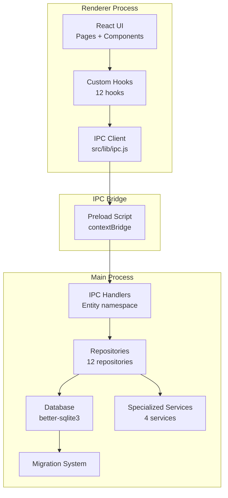

### 7.2 Data Flow

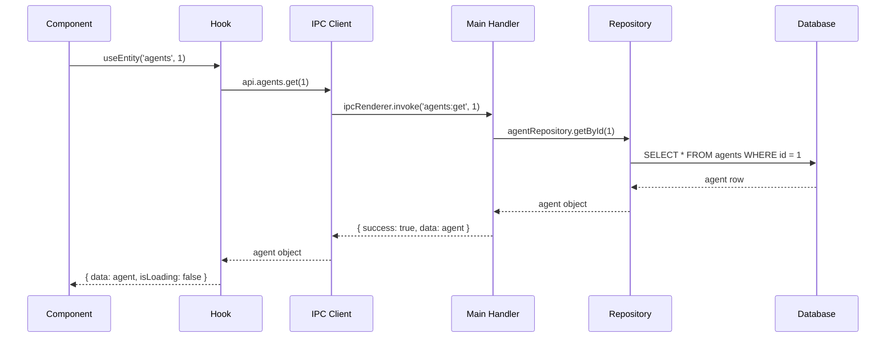

### 7.3 Layer Responsibilities

| Layer | Location | Responsibility |
|-------|----------|---------------|
| **Pages** | `src/pages/*.jsx` | Route entry, compose components |
| **Feature Components** | `src/components/features/*/` | Entity-specific UI |
| **Shared Components** | `src/components/shared/*/` | Reusable UI primitives |
| **UI Components** | `src/components/ui/*` | shadcn/ui base components |
| **Hooks** | `src/hooks/*.js` | React Query integration, state |
| **IPC Client** | `src/lib/ipc.js` | API calls to main process |
| **Main Handlers** | `electron/ipc/*.cjs` | IPC message handling |
| **Repositories** | `electron/repositories/*.cjs` | Database queries |
| **Database** | `electron/database/*.cjs` | Connection, migrations |

---

## 8. Electron Architecture

### 8.1 Main Process

**File:** `electron/main.cjs`

Responsibilities:

- Create frameless BrowserWindow (1200x800, frame: false)
- Register IPC handlers organized by entity namespace
- Initialize database on startup
- Run migrations
- Handle app lifecycle events

**IPC Handler Organization:**

```javascript
// Organized by entity namespace
ipcMain.handle('agents:list', handler)
ipcMain.handle('agents:get', handler)
ipcMain.handle('agents:create', handler)
ipcMain.handle('agents:update', handler)
ipcMain.handle('agents:delete', handler)

ipcMain.handle('providers:list', handler)
ipcMain.handle('providers:get', handler)
// ... same pattern for all entities

ipcMain.handle('db:backup', handler)
ipcMain.handle('db:restore', handler)
ipcMain.handle('db:export', handler)
ipcMain.handle('db:import', handler)

ipcMain.handle('app:version', handler)
ipcMain.handle('app:path', handler)
```

### 8.2 Preload Script

**File:** `electron/preload.cjs`

```javascript
contextBridge.exposeInMainWorld('api', {
  agents: {
    list: (filters) => ipcRenderer.invoke('agents:list', filters),
    get: (id) => ipcRenderer.invoke('agents:get', id),
    create: (data) => ipcRenderer.invoke('agents:create', data),
    update: (id, data) => ipcRenderer.invoke('agents:update', id, data),
    delete: (id) => ipcRenderer.invoke('agents:delete', id),
  },
  providers: { /* same pattern */ },
  models: { /* same pattern */ },
  // ... all entities

  db: {
    backup: (path) => ipcRenderer.invoke('db:backup', path),
    restore: (path) => ipcRenderer.invoke('db:restore', path),
    export: (format, filters) => ipcRenderer.invoke('db:export', format, filters),
    import: (path) => ipcRenderer.invoke('db:import', path),
  },

  window: {
    minimize: () => ipcRenderer.invoke('window:minimize'),
    maximize: () => ipcRenderer.invoke('window:maximize'),
    close: () => ipcRenderer.invoke('window:close'),
  },
})
```

### 8.3 Error Handling

```javascript
// Main process
ipcMain.handle('agents:list', async (event, filters) => {
  try {
    const data = await agentRepository.list(filters)
    return { success: true, data }
  } catch (error) {
    console.error('agents:list failed:', error)
    return { success: false, error: error.message }
  }
})

// Renderer (in IPC client)
async list(filters) {
  const result = await window.api.agents.list(filters)
  if (!result.success) throw new Error(result.error)
  return result.data
}
```

### 8.4 IPC Validation

All IPC handlers validate input parameters using Zod schemas (shared between main and renderer):

```javascript
// electron/ipc/agents.ipc.cjs
const { AgentCreateSchema, AgentUpdateSchema } = require('../lib/validators.cjs')

ipcMain.handle('agents:create', async (event, data) => {
  const validated = AgentCreateSchema.parse(data)
  const agent = await agentRepository.create(validated)
  return { success: true, data: agent }
})
```

---

## 9. React Architecture

### 9.1 Application Shell

```jsx
// src/App.jsx
<ThemeProvider>
  <QueryClientProvider client={queryClient}>
    <HashRouter>
      <Routes>
        <Route path="/" element={<Layout />}>
          <Route index element={<Dashboard />} />
          <Route path="agents" element={<Agents />} />
          <Route path="agents/:id" element={<AgentDetail />} />
          <Route path="providers" element={<Providers />} />
          <Route path="providers/:id" element={<ProviderDetail />} />
          <Route path="models" element={<Models />} />
          <Route path="models/:id" element={<ModelDetail />} />
          <Route path="accounts" element={<Accounts />} />
          <Route path="accounts/:id" element={<AccountDetail />} />
          <Route path="api-keys" element={<ApiKeys />} />
          <Route path="api-keys/:id" element={<ApiKeyDetail />} />
          <Route path="projects" element={<Projects />} />
          <Route path="projects/:id" element={<ProjectDetail />} />
          <Route path="analytics" element={<Analytics />} />
          <Route path="settings" element={<Settings />} />
          <Route path="search" element={<Search />} />
        </Route>
      </Routes>
    </HashRouter>
  </QueryClientProvider>
</ThemeProvider>
```

### 9.2 Layout Structure

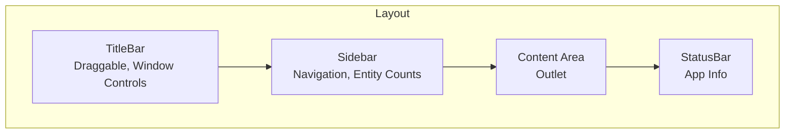

### 9.3 Feature Module Structure

Each feature follows a consistent structure:

```
features/agents/
  index.js          # Barrel export
  agents.jsx        # Page component
  agent-list.jsx    # List component
  agent-card.jsx    # Card component
  agent-detail.jsx  # Detail component
  agent-form.jsx    # Form component
  agent-columns.jsx # DataTable column definitions
```

---

## 10. Database Architecture

### 10.1 Design Principles

| Principle | Description |
|-----------|-------------|
| **Normalized** | No duplicate data. IDs for all references. |
| **Foreign Keys** | Enforced referential integrity. |
| **Indexes** | Optimized for common query patterns. |
| **Timestamps** | created_at, updated_at on every table. |
| **Soft Delete** | deleted_at for archive functionality. |
| **WAL Mode** | Concurrent reads, fast writes. |
| **Migration System** | Versioned schema changes. |

### 10.2 Entity Relationship Diagram

```mermaid
erDiagram
    providers ||--o{ models : "has"
    providers ||--o{ api_keys : "has"
    providers ||--o{ accounts : "has"
    accounts ||--o{ api_keys : "owns"
    accounts ||--o{ agents : "uses"
    models ||--o{ agents : "used_by"
    models ||--o{ usage_logs : "tracked_in"
    projects ||--o{ agents : "contains"
    projects ||--o{ usage_logs : "has"
    agents ||--o{ agent_skills : "has"
    skills ||--o{ agent_skills : "assigned_to"
    agents ||--o{ agent_mcp_servers : "has"
    mcp_servers ||--o{ agent_mcp_servers : "connected_to"
    tags ||--o{ entity_tags : "applied_to"
    categories ||--o{ entities : "categorizes"

    providers {
        integer id PK
        text name
        text slug UK
        text website
        text logo_url
        text description
        text color
        boolean is_active
        integer sort_order
        text created_at
        text updated_at
        text deleted_at
    }

    models {
        integer id PK
        integer provider_id FK
        text name
        text slug
        text model_id
        text description
        integer context_window
        integer max_output
        real cost_per_1k_input
        real cost_per_1k_output
        boolean is_active
        text created_at
        text updated_at
        text deleted_at
    }

    accounts {
        integer id PK
        integer provider_id FK
        text email
        text name
        text plan_type
        text status
        text notes
        text created_at
        text updated_at
        text deleted_at
    }

    api_keys {
        integer id PK
        integer account_id FK
        integer provider_id FK
        text name
        text key_prefix
        text key_hash
        text scopes
        text expires_at
        boolean is_active
        text last_used_at
        text created_at
        text updated_at
        text deleted_at
    }

    agents {
        integer id PK
        text name
        text description
        integer model_id FK
        integer account_id FK
        integer project_id FK
        text system_prompt
        real temperature
        integer max_tokens
        text status
        text created_at
        text updated_at
        text deleted_at
    }

    projects {
        integer id PK
        text name
        text description
        text status
        text color
        integer sort_order
        text created_at
        text updated_at
        text deleted_at
    }

    skills {
        integer id PK
        text name
        text slug UK
        text description
        text version
        text content
        text file_path
        boolean is_active
        text created_at
        text updated_at
        text deleted_at
    }

    mcp_servers {
        integer id PK
        text name
        text slug UK
        text description
        text command
        text args
        text env_vars
        text config
        boolean is_active
        text created_at
        text updated_at
        text deleted_at
    }

    tags {
        integer id PK
        text name UK
        text color
        text created_at
    }

    categories {
        integer id PK
        text name
        text parent_id FK
        text color
        integer sort_order
        text created_at
        text updated_at
    }

    notes {
        integer id PK
        text entity_type
        integer entity_id
        text title
        text content
        text created_at
        text updated_at
    }

    entity_tags {
        integer id PK
        text entity_type
        integer entity_id
        integer tag_id FK
        text created_at
    }

    usage_logs {
        integer id PK
        integer model_id FK
        integer project_id FK
        integer agent_id FK
        integer account_id FK
        integer input_tokens
        integer output_tokens
        real cost
        text model_name
        text timestamp
        text created_at
    }

    activity_history {
        integer id PK
        text entity_type
        integer entity_id
        text action
        text details
        text created_at
    }

    settings {
        text key PK
        text value
        text updated_at
    }

    quotas {
        integer id PK
        text entity_type
        integer entity_id
        text quota_type
        real limit_value
        real current_value
        text reset_interval
        integer reset_day
        text last_reset
        text next_reset
        text created_at
        text updated_at
    }

    favorites {
        integer id PK
        text entity_type
        integer entity_id
        integer sort_order
        text created_at
    }

    templates {
        integer id PK
        text name
        text entity_type
        text config
        boolean is_default
        text created_at
        text updated_at
    }

    saved_searches {
        integer id PK
        text name
        text query
        text filters
        text entity_type
        text created_at
    }

    notifications {
        integer id PK
        text type
        text title
        text message
        text entity_type
        integer entity_id
        boolean is_read
        text created_at
    }

    schema_migrations {
        integer version PK
        text name
        text applied_at
    }

    agent_skills {
        integer id PK
        integer agent_id FK
        integer skill_id FK
        text created_at
    }

    agent_mcp_servers {
        integer id PK
        integer agent_id FK
        integer mcp_server_id FK
        text created_at
    }
```

### 10.3 Table Documentation

#### providers

| Column | Type | Nullable | Default | Description |
|--------|------|----------|---------|-------------|
| id | INTEGER | NO | AUTOINCREMENT | Primary key |
| name | TEXT | NO | - | Display name (e.g., "OpenAI") |
| slug | TEXT | NO | - | URL-safe identifier (unique) |
| website | TEXT | YES | NULL | Provider website URL |
| logo_url | TEXT | YES | NULL | Logo file path or URL |
| description | TEXT | YES | NULL | Brief description |
| color | TEXT | YES | NULL | Brand color hex |
| is_active | INTEGER | NO | 1 | Whether provider is active |
| sort_order | INTEGER | NO | 0 | Display order |
| created_at | TEXT | NO | datetime('now') | Creation timestamp |
| updated_at | TEXT | NO | datetime('now') | Last update timestamp |
| deleted_at | TEXT | YES | NULL | Soft delete timestamp |

**Indexes:** slug (UNIQUE), is_active

#### models

| Column | Type | Nullable | Default | Description |
|--------|------|----------|---------|-------------|
| id | INTEGER | NO | AUTOINCREMENT | Primary key |
| provider_id | INTEGER | NO | - | FK to providers.id |
| name | TEXT | NO | - | Display name (e.g., "GPT-4o") |
| slug | TEXT | NO | - | URL-safe identifier |
| model_id | TEXT | NO | - | API model identifier |
| description | TEXT | YES | NULL | Brief description |
| context_window | INTEGER | YES | NULL | Max context tokens |
| max_output | INTEGER | YES | NULL | Max output tokens |
| cost_per_1k_input | REAL | YES | NULL | Cost per 1K input tokens |
| cost_per_1k_output | REAL | YES | NULL | Cost per 1K output tokens |
| is_active | INTEGER | NO | 1 | Whether model is active |
| created_at | TEXT | NO | datetime('now') | Creation timestamp |
| updated_at | TEXT | NO | datetime('now') | Last update timestamp |
| deleted_at | TEXT | YES | NULL | Soft delete timestamp |

**Indexes:** provider_id, is_active

#### accounts

| Column | Type | Nullable | Default | Description |
|--------|------|----------|---------|-------------|
| id | INTEGER | NO | AUTOINCREMENT | Primary key |
| provider_id | INTEGER | NO | - | FK to providers.id |
| email | TEXT | NO | - | Account email |
| name | TEXT | YES | NULL | Display name |
| plan_type | TEXT | YES | NULL | Subscription plan |
| status | TEXT | NO | 'active' | Account status |
| notes | TEXT | YES | NULL | Additional notes |
| created_at | TEXT | NO | datetime('now') | Creation timestamp |
| updated_at | TEXT | NO | datetime('now') | Last update timestamp |
| deleted_at | TEXT | YES | NULL | Soft delete timestamp |

**Indexes:** provider_id, email, status

**Status values:** active, inactive, suspended, trial, expired

#### api_keys

| Column | Type | Nullable | Default | Description |
|--------|------|----------|---------|-------------|
| id | INTEGER | NO | AUTOINCREMENT | Primary key |
| account_id | INTEGER | YES | NULL | FK to accounts.id |
| provider_id | INTEGER | NO | - | FK to providers.id |
| name | TEXT | NO | - | Key display name |
| key_prefix | TEXT | NO | - | First 8 chars for identification |
| key_hash | TEXT | NO | - | Hashed full key (SHA-256) |
| scopes | TEXT | YES | NULL | JSON array of scopes |
| expires_at | TEXT | YES | NULL | Expiration date |
| is_active | INTEGER | NO | 1 | Whether key is active |
| last_used_at | TEXT | YES | NULL | Last usage timestamp |
| created_at | TEXT | NO | datetime('now') | Creation timestamp |
| updated_at | TEXT | NO | datetime('now') | Last update timestamp |
| deleted_at | TEXT | YES | NULL | Soft delete timestamp |

**Indexes:** provider_id, account_id, is_active, expires_at

**Security:** API keys are hashed with SHA-256 on save. Only the prefix is stored in plaintext. The full key is NOT recoverable. Users must store full keys elsewhere (e.g., password manager).

#### agents

| Column | Type | Nullable | Default | Description |
|--------|------|----------|---------|-------------|
| id | INTEGER | NO | AUTOINCREMENT | Primary key |
| name | TEXT | NO | - | Agent display name |
| description | TEXT | YES | NULL | Agent description |
| model_id | INTEGER | YES | NULL | FK to models.id |
| account_id | INTEGER | YES | NULL | FK to accounts.id |
| project_id | INTEGER | YES | NULL | FK to projects.id |
| system_prompt | TEXT | YES | NULL | System prompt text |
| temperature | REAL | YES | NULL | Model temperature (0-2) |
| max_tokens | INTEGER | YES | NULL | Max tokens setting |
| status | TEXT | NO | 'active' | Agent status |
| created_at | TEXT | NO | datetime('now') | Creation timestamp |
| updated_at | TEXT | NO | datetime('now') | Last update timestamp |
| deleted_at | TEXT | YES | NULL | Soft delete timestamp |

**Indexes:** model_id, account_id, project_id, status

**Status values:** active, inactive, archived

#### projects

| Column | Type | Nullable | Default | Description |
|--------|------|----------|---------|-------------|
| id | INTEGER | NO | AUTOINCREMENT | Primary key |
| name | TEXT | NO | - | Project name |
| description | TEXT | YES | NULL | Project description |
| status | TEXT | NO | 'active' | Project status |
| color | TEXT | YES | NULL | Project color hex |
| sort_order | INTEGER | NO | 0 | Display order |
| created_at | TEXT | NO | datetime('now') | Creation timestamp |
| updated_at | TEXT | NO | datetime('now') | Last update timestamp |
| deleted_at | TEXT | YES | NULL | Soft delete timestamp |

**Status values:** active, completed, archived

#### skills

| Column | Type | Nullable | Default | Description |
|--------|------|----------|---------|-------------|
| id | INTEGER | NO | AUTOINCREMENT | Primary key |
| name | TEXT | NO | - | Skill display name |
| slug | TEXT | NO | - | URL-safe identifier (unique) |
| description | TEXT | YES | NULL | Skill description |
| version | TEXT | YES | NULL | Skill version |
| content | TEXT | YES | NULL | Skill content/instructions |
| file_path | TEXT | YES | NULL | Associated file path |
| is_active | INTEGER | NO | 1 | Whether skill is active |
| created_at | TEXT | NO | datetime('now') | Creation timestamp |
| updated_at | TEXT | NO | datetime('now') | Last update timestamp |
| deleted_at | TEXT | YES | NULL | Soft delete timestamp |

#### mcp_servers

| Column | Type | Nullable | Default | Description |
|--------|------|----------|---------|-------------|
| id | INTEGER | NO | AUTOINCREMENT | Primary key |
| name | TEXT | NO | - | Server display name |
| slug | TEXT | NO | - | URL-safe identifier (unique) |
| description | TEXT | YES | NULL | Server description |
| command | TEXT | NO | - | Server command |
| args | TEXT | YES | NULL | Command arguments (JSON) |
| env_vars | TEXT | YES | NULL | Environment variables (JSON) |
| config | TEXT | YES | NULL | Additional config (JSON) |
| is_active | INTEGER | NO | 1 | Whether server is active |
| created_at | TEXT | NO | datetime('now') | Creation timestamp |
| updated_at | TEXT | NO | datetime('now') | Last update timestamp |
| deleted_at | TEXT | YES | NULL | Soft delete timestamp |

#### tags

| Column | Type | Nullable | Default | Description |
|--------|------|----------|---------|-------------|
| id | INTEGER | NO | AUTOINCREMENT | Primary key |
| name | TEXT | NO | - | Tag name (unique) |
| color | TEXT | YES | NULL | Tag color hex |
| created_at | TEXT | NO | datetime('now') | Creation timestamp |

#### categories

| Column | Type | Nullable | Default | Description |
|--------|------|----------|---------|-------------|
| id | INTEGER | NO | AUTOINCREMENT | Primary key |
| name | TEXT | NO | - | Category name |
| parent_id | INTEGER | YES | NULL | FK to categories.id (self-referencing) |
| color | TEXT | YES | NULL | Category color hex |
| sort_order | INTEGER | NO | 0 | Display order |
| created_at | TEXT | NO | datetime('now') | Creation timestamp |
| updated_at | TEXT | NO | datetime('now') | Last update timestamp |

#### entity_tags

| Column | Type | Nullable | Default | Description |
|--------|------|----------|---------|-------------|
| id | INTEGER | NO | AUTOINCREMENT | Primary key |
| entity_type | TEXT | NO | - | Entity type (e.g., 'agent', 'provider') |
| entity_id | INTEGER | NO | - | Entity ID |
| tag_id | INTEGER | NO | - | FK to tags.id |
| created_at | TEXT | NO | datetime('now') | Creation timestamp |

**Indexes:** (entity_type, entity_id), tag_id

**Unique constraint:** (entity_type, entity_id, tag_id) — prevents duplicate tag assignments

#### notes

| Column | Type | Nullable | Default | Description |
|--------|------|----------|---------|-------------|
| id | INTEGER | NO | AUTOINCREMENT | Primary key |
| entity_type | TEXT | NO | - | Entity type |
| entity_id | INTEGER | NO | - | Entity ID |
| title | TEXT | YES | NULL | Note title |
| content | TEXT | YES | NULL | Note content (markdown) |
| created_at | TEXT | NO | datetime('now') | Creation timestamp |
| updated_at | TEXT | NO | datetime('now') | Last update timestamp |

**Indexes:** (entity_type, entity_id)

#### usage_logs

| Column | Type | Nullable | Default | Description |
|--------|------|----------|---------|-------------|
| id | INTEGER | NO | AUTOINCREMENT | Primary key |
| model_id | INTEGER | YES | NULL | FK to models.id |
| project_id | INTEGER | YES | NULL | FK to projects.id |
| agent_id | INTEGER | YES | NULL | FK to agents.id |
| account_id | INTEGER | YES | NULL | FK to accounts.id |
| input_tokens | INTEGER | YES | NULL | Input token count |
| output_tokens | INTEGER | YES | NULL | Output token count |
| cost | REAL | YES | NULL | Calculated cost |
| model_name | TEXT | YES | NULL | Model name at time of log |
| timestamp | TEXT | NO | - | Usage timestamp |
| created_at | TEXT | NO | datetime('now') | Creation timestamp |

**Indexes:** model_id, project_id, agent_id, account_id, timestamp

#### activity_history

| Column | Type | Nullable | Default | Description |
|--------|------|----------|---------|-------------|
| id | INTEGER | NO | AUTOINCREMENT | Primary key |
| entity_type | TEXT | NO | - | Entity type |
| entity_id | INTEGER | NO | - | Entity ID |
| action | TEXT | NO | - | Action performed |
| details | TEXT | YES | NULL | JSON details of change |
| created_at | TEXT | NO | datetime('now') | Action timestamp |

**Action values:** created, updated, deleted, archived, restored, viewed

**Indexes:** (entity_type, entity_id), created_at

#### settings

| Column | Type | Nullable | Default | Description |
|--------|------|----------|---------|-------------|
| key | TEXT | NO | - | Setting key (primary key) |
| value | TEXT | YES | NULL | Setting value (JSON) |
| updated_at | TEXT | NO | datetime('now') | Last update timestamp |

#### quotas

| Column | Type | Nullable | Default | Description |
|--------|------|----------|---------|-------------|
| id | INTEGER | NO | AUTOINCREMENT | Primary key |
| entity_type | TEXT | NO | - | Entity type (account, provider, agent) |
| entity_id | INTEGER | NO | - | Entity ID |
| quota_type | TEXT | NO | - | Quota type (tokens, requests, cost) |
| limit_value | REAL | NO | - | Maximum allowed |
| current_value | REAL | NO | 0 | Current usage |
| reset_interval | TEXT | YES | NULL | Reset frequency (daily, weekly, monthly) |
| reset_day | INTEGER | YES | NULL | Day of month/week for reset |
| last_reset | TEXT | YES | NULL | Last reset timestamp |
| next_reset | TEXT | YES | NULL | Next reset timestamp |
| created_at | TEXT | NO | datetime('now') | Creation timestamp |
| updated_at | TEXT | NO | datetime('now') | Last update timestamp |

#### favorites

| Column | Type | Nullable | Default | Description |
|--------|------|----------|---------|-------------|
| id | INTEGER | NO | AUTOINCREMENT | Primary key |
| entity_type | TEXT | NO | - | Entity type |
| entity_id | INTEGER | NO | - | Entity ID |
| sort_order | INTEGER | NO | 0 | Display order |
| created_at | TEXT | NO | datetime('now') | Creation timestamp |

**Unique constraint:** (entity_type, entity_id)

#### templates

| Column | Type | Nullable | Default | Description |
|--------|------|----------|---------|-------------|
| id | INTEGER | NO | AUTOINCREMENT | Primary key |
| name | TEXT | NO | - | Template name |
| entity_type | TEXT | NO | - | Entity type this template creates |
| config | TEXT | NO | - | JSON of pre-filled fields |
| is_default | INTEGER | NO | 0 | Whether this is a default template |
| created_at | TEXT | NO | datetime('now') | Creation timestamp |
| updated_at | TEXT | NO | datetime('now') | Last update timestamp |

#### saved_searches

| Column | Type | Nullable | Default | Description |
|--------|------|----------|---------|-------------|
| id | INTEGER | NO | AUTOINCREMENT | Primary key |
| name | TEXT | NO | - | Search name |
| query | TEXT | NO | - | Search query |
| filters | TEXT | YES | NULL | Filter configuration (JSON) |
| entity_type | TEXT | YES | NULL | Entity type filter |
| created_at | TEXT | NO | datetime('now') | Creation timestamp |

#### notifications

| Column | Type | Nullable | Default | Description |
|--------|------|----------|---------|-------------|
| id | INTEGER | NO | AUTOINCREMENT | Primary key |
| type | TEXT | NO | - | Notification type |
| title | TEXT | NO | - | Notification title |
| message | TEXT | YES | NULL | Notification message |
| entity_type | TEXT | YES | NULL | Related entity type |
| entity_id | INTEGER | YES | NULL | Related entity ID |
| is_read | INTEGER | NO | 0 | Read status |
| created_at | TEXT | NO | datetime('now') | Creation timestamp |

**Type values:** quota_reset, key_expiring, key_expired, backup_complete, import_complete, migration_complete

#### schema_migrations

| Column | Type | Nullable | Default | Description |
|--------|------|----------|---------|-------------|
| version | INTEGER | NO | - | Migration version (primary key) |
| name | TEXT | NO | - | Migration name |
| applied_at | TEXT | NO | datetime('now') | Application timestamp |

#### agent_skills

| Column | Type | Nullable | Default | Description |
|--------|------|----------|---------|-------------|
| id | INTEGER | NO | AUTOINCREMENT | Primary key |
| agent_id | INTEGER | NO | - | FK to agents.id |
| skill_id | INTEGER | NO | - | FK to skills.id |
| created_at | TEXT | NO | datetime('now') | Creation timestamp |

**Unique constraint:** (agent_id, skill_id)

#### agent_mcp_servers

| Column | Type | Nullable | Default | Description |
|--------|------|----------|---------|-------------|
| id | INTEGER | NO | AUTOINCREMENT | Primary key |
| agent_id | INTEGER | NO | - | FK to agents.id |
| mcp_server_id | INTEGER | NO | - | FK to mcp_servers.id |
| created_at | TEXT | NO | datetime('now') | Creation timestamp |

**Unique constraint:** (agent_id, mcp_server_id)

### 10.4 Migration System

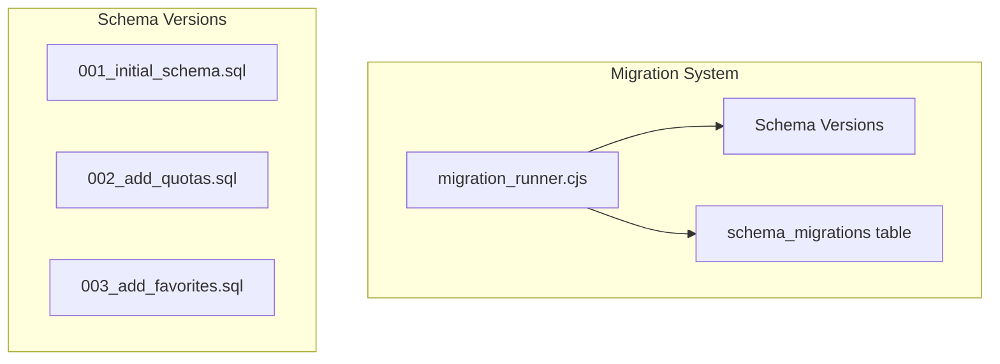

**Migration Runner Logic:**

1. Check current version from schema_migrations table
2. Find all migration files with version > current
3. Sort by version ascending
4. Execute each in a transaction
5. Record in schema_migrations table

**File Naming:** `YYYYMMDDHHMMSS_description.sql`

### 10.5 Seed Data

The application seeds initial data on first launch:

**Default Providers:**
- OpenAI (color: #10a37f)
- Anthropic (color: #d4a574)
- Google AI (color: #4285f4)
- Meta AI (color: #0668E1)
- Mistral AI (color: #FF7000)

**Default Models (per provider):**
- OpenAI: GPT-4o, GPT-4o Mini, GPT-4 Turbo, GPT-3.5 Turbo
- Anthropic: Claude 3.5 Sonnet, Claude 3.5 Haiku, Claude 3 Opus
- Google: Gemini 1.5 Pro, Gemini 1.5 Flash, Gemini 1.0 Pro
- Meta: Llama 3.1 405B, Llama 3.1 70B, Llama 3.1 8B
- Mistral: Mistral Large, Mistral Medium, Mistral Small

**Default Settings:**
- theme.mode: "system"
- sidebar.collapsed: "false"
- backup.auto: "true"
- backup.interval: "daily"
- backup.retention: "30"

**Default Dashboard:**
- 5 widgets enabled (stats, quick_actions, usage_chart, recent_activity, upcoming_resets)

### 10.6 SQLite Optimization

| Technique | Implementation |
|-----------|---------------|
| **WAL Mode** | `PRAGMA journal_mode=WAL` |
| **Foreign Keys** | `PRAGMA foreign_keys=ON` |
| **Busy Timeout** | `PRAGMA busy_timeout=5000` |
| **Cache Size** | `PRAGMA cache_size=-64000` (64MB) |
| **Page Size** | `PRAGMA page_size=4096` |
| **Synchronous** | `PRAGMA synchronous=NORMAL` |
| **Prepared Statements** | Cache all frequently used queries |
| **Indexes** | Strategic indexes for common queries |
| **Batch Operations** | Use transactions for bulk inserts |

**PRAGMA Configuration:**

```javascript
function initializeDatabase(db) {
  db.pragma('journal_mode = WAL')
  db.pragma('busy_timeout = 5000')
  db.pragma('synchronous = NORMAL')
  db.pragma('cache_size = -64000')
  db.pragma('page_size = 4096')
  db.pragma('mmap_size = 268435456')
  db.pragma('foreign_keys = ON')
}
```

**Statement Cache:**

```javascript
class StatementCache {
  constructor(db) {
    this.db = db
    this.cache = new Map()
  }

  get(sql) {
    if (!this.cache.has(sql)) {
      this.cache.set(sql, this.db.prepare(sql))
    }
    return this.cache.get(sql)
  }

  clear() {
    for (const stmt of this.cache.values()) {
      stmt.finalize()
    }
    this.cache.clear()
  }
}
```

### 10.7 Database Lifecycle

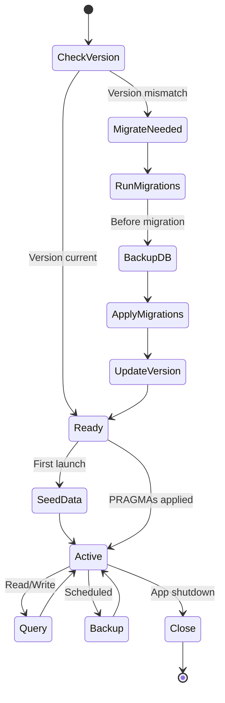

---

## 11. Folder Structure

### 11.1 Project Root

```
ai-resource-manager/
├── .github/
│   └── workflows/
│       ├── build.yml
│       ├── test.yml
│       └── release.yml
├── electron/
│   ├── main.cjs
│   ├── preload.cjs
│   ├── database/
│   │   ├── connection.cjs
│   │   ├── migration_runner.cjs
│   │   ├── migrations/
│   │   │   ├── 20260909120000_initial_schema.sql
│   │   │   └── 20260909120001_seed_data.sql
│   │   ├── seeds/
│   │   │   ├── providers.sql
│   │   │   ├── models.sql
│   │   │   └── settings.sql
│   │   └── utils.cjs
│   ├── ipc/
│   │   ├── agents.ipc.cjs
│   │   ├── providers.ipc.cjs
│   │   ├── models.ipc.cjs
│   │   ├── accounts.ipc.cjs
│   │   ├── api-keys.ipc.cjs
│   │   ├── projects.ipc.cjs
│   │   ├── notes.ipc.cjs
│   │   ├── tags.ipc.cjs
│   │   ├── usage.ipc.cjs
│   │   ├── activity.ipc.cjs
│   │   ├── settings.ipc.cjs
│   │   ├── backup.ipc.cjs
│   │   ├── search.ipc.cjs
│   │   ├── favorites.ipc.cjs
│   │   └── templates.ipc.cjs
│   ├── repositories/
│   │   ├── base_repository.cjs
│   │   ├── agent_repository.cjs
│   │   ├── provider_repository.cjs
│   │   ├── model_repository.cjs
│   │   ├── account_repository.cjs
│   │   ├── api_key_repository.cjs
│   │   ├── project_repository.cjs
│   │   ├── note_repository.cjs
│   │   ├── tag_repository.cjs
│   │   ├── usage_repository.cjs
│   │   ├── activity_repository.cjs
│   │   ├── settings_repository.cjs
│   │   ├── backup_repository.cjs
│   │   ├── search_repository.cjs
│   │   ├── favorites_repository.cjs
│   │   └── template_repository.cjs
│   ├── services/
│   │   ├── backup_service.cjs
│   │   ├── export_service.cjs
│   │   ├── import_service.cjs
│   │   └── notification_service.cjs
│   ├── lib/
│   │   ├── validators.cjs
│   │   └── constants.cjs
│   └── utils/
│       └── file_helpers.cjs
├── src/
│   ├── main.jsx
│   ├── App.jsx
│   ├── index.css
│   ├── components/
│   │   ├── ui/
│   │   │   ├── alert-dialog.jsx
│   │   │   ├── badge.jsx
│   │   │   ├── button.jsx
│   │   │   ├── calendar.jsx
│   │   │   ├── card.jsx
│   │   │   ├── checkbox.jsx
│   │   │   ├── command.jsx
│   │   │   ├── dialog.jsx
│   │   │   ├── dropdown-menu.jsx
│   │   │   ├── form.jsx
│   │   │   ├── input.jsx
│   │   │   ├── label.jsx
│   │   │   ├── popover.jsx
│   │   │   ├── scroll-area.jsx
│   │   │   ├── select.jsx
│   │   │   ├── separator.jsx
│   │   │   ├── sheet.jsx
│   │   │   ├── skeleton.jsx
│   │   │   ├── table.jsx
│   │   │   ├── tabs.jsx
│   │   │   ├── textarea.jsx
│   │   │   ├── toast.jsx
│   │   │   └── tooltip.jsx
│   │   ├── shared/
│   │   │   ├── layout/
│   │   │   │   ├── Layout.jsx
│   │   │   │   ├── Sidebar.jsx
│   │   │   │   ├── TitleBar.jsx
│   │   │   │   └── StatusBar.jsx
│   │   │   ├── data-table/
│   │   │   │   ├── DataTable.jsx
│   │   │   │   ├── DataTableColumnHeader.jsx
│   │   │   │   ├── DataTablePagination.jsx
│   │   │   │   ├── DataTableToolbar.jsx
│   │   │   │   ├── DataTableRowActions.jsx
│   │   │   │   ├── DataTableEmpty.jsx
│   │   │   │   └── DataTableSkeleton.jsx
│   │   │   ├── dialogs/
│   │   │   │   ├── EntityDialog.jsx
│   │   │   │   ├── ConfirmDialog.jsx
│   │   │   │   ├── ExportDialog.jsx
│   │   │   │   ├── ImportDialog.jsx
│   │   │   │   └── BackupDialog.jsx
│   │   │   ├── shared/
│   │   │   │   ├── EmptyState.jsx
│   │   │   │   ├── ErrorState.jsx
│   │   │   │   ├── LoadingState.jsx
│   │   │   │   ├── PageHeader.jsx
│   │   │   │   ├── SearchInput.jsx
│   │   │   │   ├── FilterBar.jsx
│   │   │   │   ├── BulkActions.jsx
│   │   │   │   ├── SortableList.jsx
│   │   │   │   └── VirtualList.jsx
│   │   │   └── entity/
│   │   │       ├── EntityHeader.jsx
│   │   │       ├── EntityInfo.jsx
│   │   │       ├── EntityMetadata.jsx
│   │   │       ├── EntityActions.jsx
│   │   │       └── EntityTags.jsx
│   │   └── features/
│   │       ├── agents/
│   │       │   ├── index.js
│   │       │   ├── agents.jsx
│   │       │   ├── agent-list.jsx
│   │       │   ├── agent-card.jsx
│   │       │   ├── agent-detail.jsx
│   │       │   ├── agent-form.jsx
│   │       │   └── agent-columns.jsx
│   │       ├── providers/
│   │       │   ├── index.js
│   │       │   ├── providers.jsx
│   │       │   ├── provider-list.jsx
│   │       │   ├── provider-card.jsx
│   │       │   ├── provider-detail.jsx
│   │       │   ├── provider-form.jsx
│   │       │   └── provider-columns.jsx
│   │       ├── models/
│   │       │   ├── index.js
│   │       │   ├── models.jsx
│   │       │   ├── model-list.jsx
│   │       │   ├── model-card.jsx
│   │       │   ├── model-detail.jsx
│   │       │   ├── model-form.jsx
│   │       │   └── model-columns.jsx
│   │       ├── accounts/
│   │       │   ├── index.js
│   │       │   ├── accounts.jsx
│   │       │   ├── account-list.jsx
│   │       │   ├── account-card.jsx
│   │       │   ├── account-detail.jsx
│   │       │   ├── account-form.jsx
│   │       │   └── account-columns.jsx
│   │       ├── api-keys/
│   │       │   ├── index.js
│   │       │   ├── api-keys.jsx
│   │       │   ├── api-key-list.jsx
│   │       │   ├── api-key-card.jsx
│   │       │   ├── api-key-detail.jsx
│   │       │   ├── api-key-form.jsx
│   │       │   └── api-key-columns.jsx
│   │       ├── projects/
│   │       │   ├── index.js
│   │       │   ├── projects.jsx
│   │       │   ├── project-list.jsx
│   │       │   ├── project-card.jsx
│   │       │   ├── project-detail.jsx
│   │       │   ├── project-form.jsx
│   │       │   └── project-columns.jsx
│   │       ├── dashboard/
│   │       │   ├── index.js
│   │       │   ├── dashboard.jsx
│   │       │   ├── widgets/
│   │       │   │   ├── index.js
│   │       │   │   ├── StatsWidget.jsx
│   │       │   │   ├── QuickActionsWidget.jsx
│   │       │   │   ├── UsageChartWidget.jsx
│   │       │   │   ├── RecentActivityWidget.jsx
│   │       │   │   └── UpcomingResetsWidget.jsx
│   │       │   └── dashboard-columns.jsx
│   │       ├── analytics/
│   │       │   ├── index.js
│   │       │   ├── analytics.jsx
│   │       │   ├── usage-trends.jsx
│   │       │   ├── cost-analysis.jsx
│   │       │   └── model-performance.jsx
│   │       ├── search/
│   │       │   ├── index.js
│   │       │   └── search.jsx
│   │       ├── settings/
│   │       │   ├── index.js
│   │       │   └── settings.jsx
│   │       └── notes/
│   │           ├── index.js
│   │           ├── notes.jsx
│   │           └── note-editor.jsx
│   ├── hooks/
│   │   ├── index.js
│   │   ├── use-agents.js
│   │   ├── use-providers.js
│   │   ├── use-models.js
│   │   ├── use-accounts.js
│   │   ├── use-api-keys.js
│   │   ├── use-projects.js
│   │   ├── use-tags.js
│   │   ├── use-notes.js
│   │   ├── use-usage.js
│   │   ├── use-settings.js
│   │   ├── use-search.js
│   │   └── use-themes.js
│   ├── lib/
│   │   ├── ipc.js
│   │   ├── query-client.js
│   │   ├── validators.js
│   │   ├── constants.js
│   │   └── utils.js
│   ├── pages/
│   │   ├── Dashboard.jsx
│   │   ├── Agents.jsx
│   │   ├── AgentDetail.jsx
│   │   ├── Providers.jsx
│   │   ├── ProviderDetail.jsx
│   │   ├── Models.jsx
│   │   ├── ModelDetail.jsx
│   │   ├── Accounts.jsx
│   │   ├── AccountDetail.jsx
│   │   ├── ApiKeys.jsx
│   │   ├── ApiKeyDetail.jsx
│   │   ├── Projects.jsx
│   │   ├── ProjectDetail.jsx
│   │   ├── Analytics.jsx
│   │   ├── Search.jsx
│   │   ├── Settings.jsx
│   │   └── Notes.jsx
│   └── stores/
│       ├── sidebar-store.js
│       └── command-palette-store.js
├── public/
│   ├── favicon.ico
│   └── icons/
├── tests/
│   ├── unit/
│   │   ├── repositories/
│   │   └── hooks/
│   ├── integration/
│   │   ├── ipc-handlers/
│   │   └── database/
│   └── e2e/
│       └── workflows/
├── scripts/
│   ├── dev.cjs
│   ├── build.cjs
│   └── release.cjs
├── resources/
│   └── icon.png
├── electron-builder.yml
├── forge.config.cjs
├── package.json
├── vite.config.js
├── tailwind.config.js
├── components.json
├── postcss.config.js
├── jsconfig.json
├── .eslintrc.cjs
├── .prettierrc
├── .gitignore
├── .env.example
├── CONSTRAINTS.md
├── AGENTS.md
└── README.md
```

### 11.2 File Organization Rules

| Rule | Description |
|------|-------------|
| **One component per file** | Each component in its own file |
| **Feature folders** | Group by feature, not by type |
| **Index files** | Barrel exports for clean imports |
| **Naming** | kebab-case for files, PascalCase for components |
| **Tests colocated** | Test files next to source files |

---

## 12. Feature Modules

### 12.1 Module Inventory

| Module | Priority | Complexity | Status |
|--------|----------|------------|--------|
| Dashboard | P0 | Medium | v2.0 |
| Agents | P0 | Medium | v2.0 |
| Providers | P0 | Low | v2.0 |
| Models | P0 | Medium | v2.0 |
| Accounts | P0 | Low | v2.0 |
| API Keys | P0 | Medium | v2.0 |
| Projects | P0 | Low | v2.0 |
| Notes | P1 | Low | v2.0 |
| Tags | P1 | Low | v2.0 |
| Activity History | P1 | Low | v2.0 |
| Analytics | P2 | High | v2.1 |
| Settings | P0 | Low | v2.0 |
| Search | P0 | Medium | v2.0 |
| Command Palette | P0 | Medium | v2.0 |
| Backup/Restore | P0 | Medium | v2.0 |
| Import/Export | P1 | Medium | v2.0 |
| Notifications | P2 | Low | v2.1 |

### 12.2 Module Dependencies

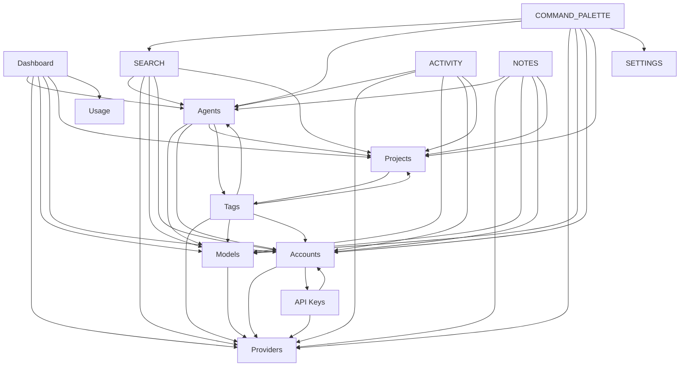

---

## 13. Entity System

### 13.1 Entity Definition

Each entity follows a consistent structure:

```javascript
// Entity type definition
const ENTITY_TYPES = {
  agent: {
    label: 'Agent',
    plural: 'Agents',
    icon: 'Bot',
    color: '#8b5cf6',
    route: '/agents',
    columns: ['name', 'description', 'model', 'status'],
    sortable: ['name', 'created_at', 'updated_at'],
    filterable: ['status', 'model_id', 'project_id'],
    searchable: ['name', 'description', 'system_prompt'],
  },
  provider: {
    label: 'Provider',
    plural: 'Providers',
    icon: 'Building2',
    color: '#3b82f6',
    route: '/providers',
    columns: ['name', 'website', 'models_count', 'status'],
    sortable: ['name', 'created_at', 'sort_order'],
    filterable: ['is_active'],
    searchable: ['name', 'description'],
  },
  model: {
    label: 'Model',
    plural: 'Models',
    icon: 'Brain',
    color: '#10b981',
    route: '/models',
    columns: ['name', 'provider', 'context_window', 'cost'],
    sortable: ['name', 'created_at', 'cost_per_1k_input'],
    filterable: ['provider_id', 'is_active'],
    searchable: ['name', 'model_id', 'description'],
  },
  account: {
    label: 'Account',
    plural: 'Accounts',
    icon: 'User',
    color: '#f59e0b',
    route: '/accounts',
    columns: ['email', 'provider', 'plan_type', 'status'],
    sortable: ['email', 'created_at'],
    filterable: ['provider_id', 'status'],
    searchable: ['email', 'name'],
  },
  api_key: {
    label: 'API Key',
    plural: 'API Keys',
    icon: 'Key',
    color: '#ef4444',
    route: '/api-keys',
    columns: ['name', 'provider', 'prefix', 'expires_at'],
    sortable: ['name', 'created_at', 'expires_at'],
    filterable: ['provider_id', 'account_id', 'is_active'],
    searchable: ['name', 'key_prefix'],
  },
  project: {
    label: 'Project',
    plural: 'Projects',
    icon: 'FolderOpen',
    color: '#6366f1',
    route: '/projects',
    columns: ['name', 'description', 'status', 'agents_count'],
    sortable: ['name', 'created_at', 'sort_order'],
    filterable: ['status'],
    searchable: ['name', 'description'],
  },
  note: {
    label: 'Note',
    plural: 'Notes',
    icon: 'FileText',
    color: '#8b5cf6',
    route: '/notes',
    columns: ['title', 'entity_type', 'entity_id', 'updated_at'],
    sortable: ['title', 'created_at', 'updated_at'],
    filterable: ['entity_type'],
    searchable: ['title', 'content'],
  },
  tag: {
    label: 'Tag',
    plural: 'Tags',
    icon: 'Tag',
    color: '#06b6d4',
    route: '/tags',
    columns: ['name', 'color', 'entities_count'],
    sortable: ['name', 'created_at'],
    filterable: [],
    searchable: ['name'],
  },
  category: {
    label: 'Category',
    plural: 'Categories',
    icon: 'LayoutGrid',
    color: '#84cc16',
    route: '/categories',
    columns: ['name', 'parent', 'color', 'sort_order'],
    sortable: ['name', 'sort_order'],
    filterable: ['parent_id'],
    searchable: ['name'],
  },
  skill: {
    label: 'Skill',
    plural: 'Skills',
    icon: 'Sparkles',
    color: '#a855f7',
    route: '/skills',
    columns: ['name', 'version', 'is_active'],
    sortable: ['name', 'created_at'],
    filterable: ['is_active'],
    searchable: ['name', 'description'],
  },
  mcp_server: {
    label: 'MCP Server',
    plural: 'MCP Servers',
    icon: 'Server',
    color: '#ec4899',
    route: '/mcp-servers',
    columns: ['name', 'command', 'is_active'],
    sortable: ['name', 'created_at'],
    filterable: ['is_active'],
    searchable: ['name', 'description', 'command'],
  },
}
```

### 13.2 Entity Lifecycle

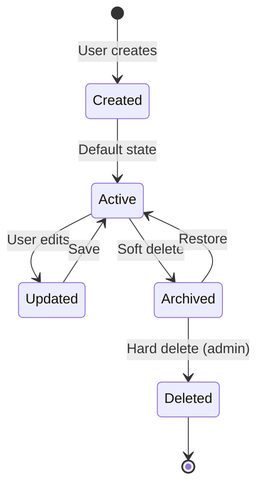

---

## 14. Generic CRUD Strategy

### 14.1 Pattern Overview

The generic CRUD system allows adding new entities with minimal code by providing:

1. **Generic Repository** — Base class with common database operations
2. **Generic Hook** — React Query integration for any entity
3. **Generic Form** — React Hook Form + Zod validation
4. **Generic Table** — TanStack Table with sortable/filterable columns
5. **Generic Dialog** — Create/Edit dialogs with consistent UX

### 14.2 Generic Repository

```javascript
// electron/repositories/base_repository.cjs
class BaseRepository {
  constructor(db, tableName) {
    this.db = db
    this.tableName = tableName
    this.statementCache = new StatementCache(db)
  }

  getById(id) {
    const sql = `SELECT * FROM ${this.tableName} WHERE id = ? AND deleted_at IS NULL`
    return this.statementCache.get(sql).get(id)
  }

  list(filters = {}) {
    let sql = `SELECT * FROM ${this.tableName} WHERE deleted_at IS NULL`
    const params = []

    // Dynamic filtering
    for (const [key, value] of Object.entries(filters)) {
      if (value !== undefined && value !== null) {
        sql += ` AND ${key} = ?`
        params.push(value)
      }
    }

    // Dynamic sorting
    if (filters.sort) {
      sql += ` ORDER BY ${filters.sort} ${filters.order || 'ASC'}`
    } else {
      sql += ` ORDER BY created_at DESC`
    }

    // Pagination
    if (filters.limit) {
      sql += ` LIMIT ?`
      params.push(filters.limit)
      if (filters.offset) {
        sql += ` OFFSET ?`
        params.push(filters.offset)
      }
    }

    return this.statementCache.get(sql).all(...params)
  }

  create(data) {
    const columns = Object.keys(data)
    const placeholders = columns.map(() => '?').join(', ')
    const sql = `INSERT INTO ${this.tableName} (${columns.join(', ')}) VALUES (${placeholders})`

    const result = this.statementCache.get(sql).run(...Object.values(data))
    return this.getById(result.lastInsertRowid)
  }

  update(id, data) {
    const setClause = Object.keys(data).map(key => `${key} = ?`).join(', ')
    const sql = `UPDATE ${this.tableName} SET ${setClause}, updated_at = datetime('now') WHERE id = ?`

    this.statementCache.get(sql).run(...Object.values(data), id)
    return this.getById(id)
  }

  softDelete(id) {
    const sql = `UPDATE ${this.tableName} SET deleted_at = datetime('now') WHERE id = ?`
    this.statementCache.get(sql).run(id)
    return { success: true }
  }

  hardDelete(id) {
    const sql = `DELETE FROM ${this.tableName} WHERE id = ?`
    this.statementCache.get(sql).run(id)
    return { success: true }
  }

  count(filters = {}) {
    let sql = `SELECT COUNT(*) as count FROM ${this.tableName} WHERE deleted_at IS NULL`
    const params = []

    for (const [key, value] of Object.entries(filters)) {
      if (value !== undefined && value !== null) {
        sql += ` AND ${key} = ?`
        params.push(value)
      }
    }

    return this.statementCache.get(sql).get(...params).count
  }

  search(query, fields) {
    const conditions = fields.map(field => `${field} LIKE ?`).join(' OR ')
    const sql = `SELECT * FROM ${this.tableName} WHERE deleted_at IS NULL AND (${conditions})`
    const params = fields.map(() => `%${query}%`)

    return this.statementCache.get(sql).all(...params)
  }

  transaction(fn) {
    return this.db.transaction(fn)()
  }
}

module.exports = BaseRepository
```

### 14.3 Generic Hook

```javascript
// src/hooks/use-entity.js
import { useQuery, useMutation, useQueryClient } from '@tanstack/react-query'
import { api } from '../lib/ipc'

export function useEntity(type, id) {
  const queryClient = useQueryClient()

  const query = useQuery({
    queryKey: [type, id],
    queryFn: () => api[type].get(id),
    enabled: !!id,
  })

  const create = useMutation({
    mutationFn: (data) => api[type].create(data),
    onSuccess: () => {
      queryClient.invalidateQueries({ queryKey: [type] })
    },
  })

  const update = useMutation({
    mutationFn: ({ id, ...data }) => api[type].update(id, data),
    onSuccess: () => {
      queryClient.invalidateQueries({ queryKey: [type] })
      if (id) queryClient.invalidateQueries({ queryKey: [type, id] })
    },
  })

  const remove = useMutation({
    mutationFn: (id) => api[type].delete(id),
    onSuccess: () => {
      queryClient.invalidateQueries({ queryKey: [type] })
    },
  })

  return {
    data: query.data,
    isLoading: query.isLoading,
    error: query.error,
    create,
    update,
    remove,
  }
}
```

### 14.4 Adding a New Entity

To add a new entity type, you need:

1. **Database:** Add table in migration SQL
2. **Repository:** Create repository extending BaseRepository
3. **IPC Handler:** Create handler file (copy pattern from existing)
4. **Preload:** Add to window.api in preload.cjs
5. **Hook:** Create hook using useEntity pattern
6. **Components:** Create feature module components
7. **Route:** Add route in App.jsx
8. **Sidebar:** Add navigation item

**Checklist for new entity:**

- [ ] Migration SQL file
- [ ] Repository class
- [ ] IPC handler file
- [ ] Preload API methods
- [ ] React hook
- [ ] Page component
- [ ] List component
- [ ] Card component
- [ ] Detail component
- [ ] Form component
- [ ] Column definitions
- [ ] Route in App.jsx
- [ ] Sidebar navigation item
- [ ] Entity type definition

---

## 15. Autocomplete System

### 15.1 Architecture

The autocomplete system provides real-time search suggestions across all entities.

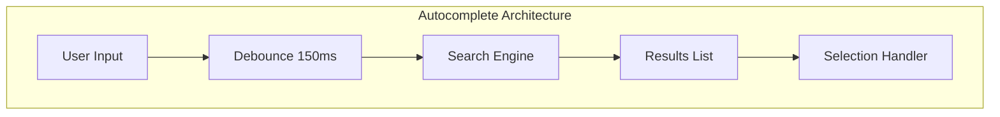

### 15.2 Implementation

```javascript
// src/hooks/use-autocomplete.js
import { useState, useCallback, useRef } from 'react'
import { useQuery } from '@tanstack/react-query'
import { api } from '../lib/ipc'

export function useAutocomplete(entityType, options = {}) {
  const [query, setQuery] = useState('')
  const [isOpen, setIsOpen] = useState(false)
  const [selectedIndex, setSelectedIndex] = useState(-1)
  const inputRef = useRef(null)
  const listRef = useRef(null)

  const { data: results = [], isLoading } = useQuery({
    queryKey: [entityType, 'search', query],
    queryFn: () => api[entityType].search(query, options.fields),
    enabled: query.length >= 2 && isOpen,
    staleTime: 30000,
  })

  const handleKeyDown = useCallback((e) => {
    switch (e.key) {
      case 'ArrowDown':
        e.preventDefault()
        setSelectedIndex(i => Math.min(i + 1, results.length - 1))
        break
      case 'ArrowUp':
        e.preventDefault()
        setSelectedIndex(i => Math.max(i - 1, -1))
        break
      case 'Enter':
        e.preventDefault()
        if (selectedIndex >= 0) {
          options.onSelect(results[selectedIndex])
          setIsOpen(false)
        }
        break
      case 'Escape':
        setIsOpen(false)
        break
    }
  }, [results, selectedIndex, options])

  return {
    query,
    setQuery,
    isOpen,
    setIsOpen,
    results,
    isLoading,
    selectedIndex,
    setSelectedIndex,
    inputRef,
    listRef,
    handleKeyDown,
  }
}
```

### 15.3 Autocomplete Components

| Component | Purpose |
|-----------|---------|
| `AutocompleteInput` | Text input with search |
| `AutocompleteList` | Results dropdown |
| `AutocompleteItem` | Individual result |
| `AutocompleteGroup` | Grouped results |
| `AutocompleteEmpty` | No results state |

---

## 16. Generic Form Engine

### 16.1 Form Definition

```javascript
// Example form definition for Agent
export const agentFormSchema = z.object({
  name: z.string().min(1, 'Name is required').max(100),
  description: z.string().max(500).optional(),
  model_id: z.number().optional(),
  account_id: z.number().optional(),
  project_id: z.number().optional(),
  system_prompt: z.string().max(10000).optional(),
  temperature: z.number().min(0).max(2).optional(),
  max_tokens: z.number().min(1).max(100000).optional(),
  status: z.enum(['active', 'inactive', 'archived']).default('active'),
})

export const agentFormFields = [
  {
    name: 'name',
    label: 'Name',
    type: 'text',
    required: true,
    placeholder: 'Enter agent name',
  },
  {
    name: 'description',
    label: 'Description',
    type: 'textarea',
    placeholder: 'Enter agent description',
  },
  {
    name: 'model_id',
    label: 'Model',
    type: 'autocomplete',
    entity: 'model',
    placeholder: 'Search models...',
  },
  {
    name: 'account_id',
    label: 'Account',
    type: 'autocomplete',
    entity: 'account',
    placeholder: 'Search accounts...',
  },
  {
    name: 'project_id',
    label: 'Project',
    type: 'autocomplete',
    entity: 'project',
    placeholder: 'Search projects...',
  },
  {
    name: 'system_prompt',
    label: 'System Prompt',
    type: 'textarea',
    rows: 6,
    placeholder: 'Enter system prompt',
  },
  {
    name: 'temperature',
    label: 'Temperature',
    type: 'slider',
    min: 0,
    max: 2,
    step: 0.1,
    defaultValue: 0.7,
  },
  {
    name: 'max_tokens',
    label: 'Max Tokens',
    type: 'number',
    min: 1,
    max: 100000,
    defaultValue: 4096,
  },
  {
    name: 'status',
    label: 'Status',
    type: 'select',
    options: [
      { value: 'active', label: 'Active' },
      { value: 'inactive', label: 'Inactive' },
      { value: 'archived', label: 'Archived' },
    ],
    defaultValue: 'active',
  },
]
```

### 16.2 Form Field Types

| Type | Component | Props |
|------|-----------|-------|
| `text` | `Input` | placeholder, maxLength |
| `textarea` | `Textarea` | rows, placeholder |
| `number` | `Input` type="number" | min, max, step |
| `select` | `Select` | options, placeholder |
| `autocomplete` | `Autocomplete` | entity, fields, placeholder |
| `checkbox` | `Checkbox` | label |
| `switch` | `Switch` | label |
| `slider` | `Slider` | min, max, step |
| `date` | `Calendar` | min, max |
| `tags` | `TagInput` | entity, max |

### 16.3 Generic Form Component

```jsx
// src/components/shared/form/GenericForm.jsx
export function GenericForm({ schema, fields, onSubmit, defaultValues }) {
  const form = useForm({
    resolver: zodResolver(schema),
    defaultValues,
  })

  return (
    <Form {...form}>
      <form onSubmit={form.handleSubmit(onSubmit)} className="space-y-6">
        {fields.map((field) => (
          <FormField
            key={field.name}
            control={form.control}
            name={field.name}
            render={({ field: fieldProps }) => (
              <FormItem>
                <FormLabel>{field.label}</FormLabel>
                <FormControl>
                  <FormFieldRenderer field={field} {...fieldProps} />
                </FormControl>
                <FormMessage />
              </FormItem>
            )}
          />
        ))}
        <div className="flex justify-end gap-2">
          <Button type="button" variant="outline" onClick={onCancel}>
            Cancel
          </Button>
          <Button type="submit" disabled={form.formState.isSubmitting}>
            Save
          </Button>
        </div>
      </form>
    </Form>
  )
}
```

---

## 17. Dashboard

### 17.1 Widget System

The dashboard uses a fixed layout with 5 essential widgets:

| Widget | Description | Priority |
|--------|-------------|----------|
| `StatsWidget` | Key metrics at a glance | P0 |
| `QuickActionsWidget` | Common actions | P0 |
| `UsageChartWidget` | Token usage over time | P0 |
| `RecentActivityWidget` | Latest actions | P1 |
| `UpcomingResetsWidget` | Quota reset schedule | P2 |

### 17.2 Widget Architecture

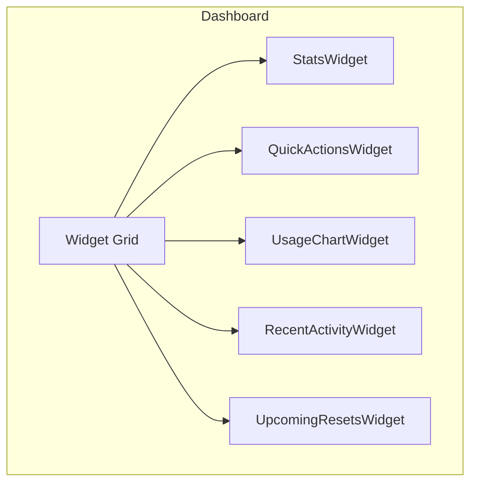

### 17.3 Stats Widget

Displays key metrics:

- Total Agents
- Active Providers
- API Keys (active/expiring)
- Monthly Usage (tokens)
- Monthly Cost

```jsx
function StatsWidget() {
  const { data: stats } = useQuery({
    queryKey: ['dashboard', 'stats'],
    queryFn: api.dashboard.getStats,
  })

  return (
    <div className="grid grid-cols-2 lg:grid-cols-4 gap-4">
      <StatCard
        title="Total Agents"
        value={stats.agents.total}
        icon={Bot}
        trend={stats.agents.trend}
      />
      <StatCard
        title="Active Providers"
        value={stats.providers.active}
        icon={Building2}
      />
      <StatCard
        title="API Keys"
        value={stats.apiKeys.active}
        subtitle={`${stats.apiKeys.expiring} expiring`}
        icon={Key}
        variant={stats.apiKeys.expiring > 0 ? 'warning' : 'default'}
      />
      <StatCard
        title="Monthly Usage"
        value={formatNumber(stats.usage.tokens)}
        subtitle={`$${stats.usage.cost.toFixed(2)}`}
        icon={Activity}
      />
    </div>
  )
}
```

### 17.4 Quick Actions Widget

Common actions accessible with one click:

| Action | Description |
|--------|-------------|
| New Agent | Opens agent creation dialog |
| New Provider | Opens provider creation dialog |
| New API Key | Opens API key creation dialog |
| New Project | Opens project creation dialog |
| Import Data | Opens import dialog |
| Export Data | Opens export dialog |
| Backup | Triggers backup |
| Settings | Opens settings page |

### 17.5 Usage Chart Widget

Line chart showing token usage over time:

- Time range selector (7d, 30d, 90d, 1y)
- Stacked area chart (input/output tokens)
- Provider breakdown (toggleable)
- Hover tooltips with details

### 17.6 Recent Activity Widget

List of recent actions across all entities:

- Entity type icon
- Action performed (created, updated, deleted)
- Entity name (linked)
- Timestamp (relative)

### 17.7 Upcoming Resets Widget

Quotas approaching their reset date:

- Quota type and entity
- Current usage vs limit
- Days until reset
- Warning state if >80% used

---

## 18. Agents

### 18.1 Agent List View

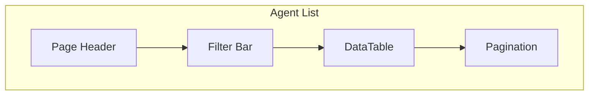

**Features:**

- Sortable columns: Name, Model, Status, Created
- Filters: Status, Model, Provider, Project
- Search: Name, Description
- Bulk actions: Delete, Export
- Row click: Navigate to detail

### 18.2 Agent Detail View

| Section | Content |
|---------|---------|
| **Header** | Name, Status, Actions (Edit, Delete, Archive) |
| **Info** | Description, System Prompt, Temperature, Max Tokens |
| **Relationships** | Model, Account, Project |
| **Tags** | Associated tags with add/remove |
| **Skills** | Associated skills (v2.2) |
| **MCP Servers** | Associated MCP servers (v2.2) |
| **Activity** | Recent activity for this agent |
| **Notes** | Agent-specific notes |

### 18.3 Agent Form

| Field | Type | Required | Validation |
|-------|------|----------|------------|
| name | text | Yes | 1-100 chars |
| description | textarea | No | Max 500 chars |
| model_id | autocomplete | No | Valid model ID |
| account_id | autocomplete | No | Valid account ID |
| project_id | autocomplete | No | Valid project ID |
| system_prompt | textarea | No | Max 10,000 chars |
| temperature | slider | No | 0-2, step 0.1 |
| max_tokens | number | No | 1-100,000 |
| status | select | Yes | active/inactive/archived |

---

## 19. Providers

### 19.1 Provider List View

**Features:**

- Sortable columns: Name, Website, Models, Status
- Filters: Active/Inactive
- Search: Name, Description
- Card view option (with logo/color)
- Row click: Navigate to detail

### 19.2 Provider Detail View

| Section | Content |
|---------|---------|
| **Header** | Name, Logo, Color, Website link, Actions |
| **Info** | Description, Website |
| **Models** | List of models from this provider |
| **Accounts** | Accounts for this provider |
| **API Keys** | API keys for this provider |
| **Usage** | Usage statistics for this provider |
| **Activity** | Recent activity |

### 19.3 Provider Form

| Field | Type | Required | Validation |
|-------|------|----------|------------|
| name | text | Yes | 1-100 chars |
| slug | text | Yes | Auto-generated from name, unique |
| website | url | No | Valid URL |
| description | textarea | No | Max 500 chars |
| color | color picker | No | Hex color |
| is_active | switch | Yes | Default: true |
| sort_order | number | No | Default: 0 |

---

## 20. Models

### 20.1 Model List View

**Features:**

- Sortable columns: Name, Provider, Context, Cost
- Filters: Provider, Active/Inactive
- Search: Name, Model ID, Description
- Cost column shows input/output pricing
- Row click: Navigate to detail

### 20.2 Model Detail View

| Section | Content |
|---------|---------|
| **Header** | Name, Provider badge, Actions |
| **Pricing** | Cost per 1K input/output tokens |
| **Capabilities** | Context window, Max output |
| **Agents** | Agents using this model |
| **Usage** | Usage statistics |
| **Activity** | Recent activity |

### 20.3 Model Form

| Field | Type | Required | Validation |
|-------|------|----------|------------|
| name | text | Yes | 1-100 chars |
| provider_id | autocomplete | Yes | Valid provider ID |
| slug | text | Yes | Auto-generated, unique |
| model_id | text | Yes | API model identifier |
| description | textarea | No | Max 500 chars |
| context_window | number | No | Positive integer |
| max_output | number | No | Positive integer |
| cost_per_1k_input | number | No | Min 0 |
| cost_per_1k_output | number | No | Min 0 |
| is_active | switch | Yes | Default: true |

---

## 21. Accounts

### 21.1 Account List View

**Features:**

- Sortable columns: Email, Provider, Plan, Status
- Filters: Provider, Status
- Search: Email, Name
- Status badges (active, inactive, suspended, trial, expired)
- Row click: Navigate to detail

### 21.2 Account Detail View

| Section | Content |
|---------|---------|
| **Header** | Email, Provider badge, Status badge, Actions |
| **Info** | Name, Plan Type, Notes |
| **API Keys** | Associated API keys |
| **Usage** | Usage statistics for this account |
| **Activity** | Recent activity |

### 21.3 Account Form

| Field | Type | Required | Validation |
|-------|------|----------|------------|
| email | email | Yes | Valid email format |
| provider_id | autocomplete | Yes | Valid provider ID |
| name | text | No | Max 100 chars |
| plan_type | select | No | Free/Pro/Enterprise/Custom |
| status | select | Yes | active/inactive/suspended/trial/expired |
| notes | textarea | No | Max 500 chars |

---

## 22. API Keys

### 22.1 Security Model

| Aspect | Implementation |
|--------|---------------|
| **Storage** | Only prefix (first 8 chars) + SHA-256 hash |
| **Display** | `sk-...xxxx` format |
| **Full Key** | NEVER stored, user must save elsewhere |
| **Validation** | Prefix format check, hash comparison |
| **Expiration** | Optional, tracked with notifications |

### 22.2 API Key List View

**Features:**

- Sortable columns: Name, Provider, Prefix, Expires
- Filters: Provider, Account, Active/Inactive
- Search: Name, Prefix
- Expiration warnings (color-coded)
- Row click: Navigate to detail

### 22.3 API Key Detail View

| Section | Content |
|---------|---------|
| **Header** | Name, Provider badge, Status badge, Actions |
| **Security** | Key prefix, Hash, Scopes |
| **Expiration** | Expires at, Last used |
| **Account** | Associated account |
| **Activity** | Recent activity |

### 22.4 API Key Form

| Field | Type | Required | Validation |
|-------|------|----------|------------|
| name | text | Yes | 1-100 chars |
| provider_id | autocomplete | Yes | Valid provider ID |
| account_id | autocomplete | No | Valid account ID |
| full_key | text | Yes | Min 10 chars |
| scopes | multi-select | No | Array of scope strings |
| expires_at | date | No | Future date |
| is_active | switch | Yes | Default: true |

---

## 23. Projects

### 23.1 Project List View

**Features:**

- Sortable columns: Name, Status, Agents, Created
- Filters: Status
- Search: Name, Description
- Color-coded project cards
- Row click: Navigate to detail

### 23.2 Project Detail View

| Section | Content |
|---------|---------|
| **Header** | Name, Color badge, Status badge, Actions |
| **Info** | Description, Status |
| **Agents** | Agents in this project |
| **Usage** | Usage statistics for this project |
| **Notes** | Project-specific notes |
| **Activity** | Recent activity |

### 23.3 Project Form

| Field | Type | Required | Validation |
|-------|------|----------|------------|
| name | text | Yes | 1-100 chars |
| description | textarea | No | Max 500 chars |
| status | select | Yes | active/completed/archived |
| color | color picker | No | Hex color |
| sort_order | number | No | Default: 0 |

---

## 24. Notes

### 24.1 Notes Architecture

Notes are polymorphic — they can be attached to any entity type:

```javascript
// Note structure
{
  id: 1,
  entity_type: 'agent',  // or 'provider', 'model', 'account', etc.
  entity_id: 42,
  title: 'Prompt Engineering Notes',
  content: '# Notes\n\nUse these strategies...',
  created_at: '2026-09-09T10:00:00Z',
  updated_at: '2026-09-09T10:00:00Z',
}
```

### 24.2 Note Editor

| Feature | Description |
|---------|-------------|
| **Rich Text** | Markdown-based editor |
| **Auto-save** | Save on blur or after 30s idle |
| **Version History** | Optional version tracking |
| **Attachments** | File attachment support (v2.1) |
| **Search** | Full-text search within notes |

### 24.3 Note Form

| Field | Type | Required | Validation |
|-------|------|----------|------------|
| entity_type | hidden | Yes | Set by context |
| entity_id | hidden | Yes | Set by context |
| title | text | No | Max 200 chars |
| content | textarea | No | Max 50,000 chars |

---

## 25. Tags

### 25.1 Tag Architecture

Tags provide flexible categorization across all entities:

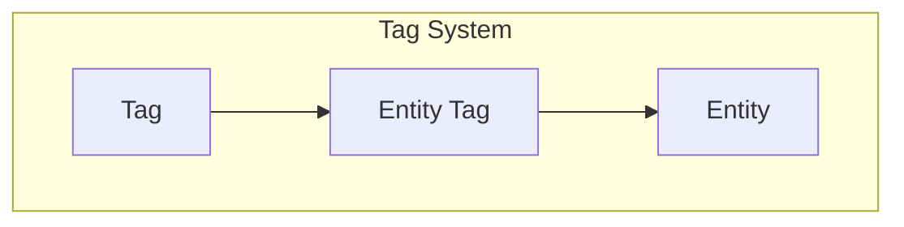

### 25.2 Tag Management

| Operation | Description |
|-----------|-------------|
| **Create** | Name + optional color |
| **Assign** | Add tag to any entity |
| **Remove** | Remove tag from entity |
| **Delete** | Remove tag entirely (cascades) |
| **Filter** | Filter entities by tag |
| **Search** | Search tags by name |

### 25.3 Tag Form

| Field | Type | Required | Validation |
|-------|------|----------|------------|
| name | text | Yes | 1-50 chars, unique |
| color | color picker | No | Hex color |

---

## 26. Activity History

### 26.1 Activity Tracking

All entity operations are automatically tracked:

| Action | Description | Details |
|--------|-------------|---------|
| `created` | Entity created | Full entity snapshot |
| `updated` | Entity modified | Changed fields only |
| `deleted` | Entity soft-deleted | Entity reference |
| `archived` | Entity archived | Entity reference |
| `restored` | Entity restored | Entity reference |
| `viewed` | Entity viewed | View timestamp |

### 26.2 Activity Feed

```javascript
// Activity structure
{
  id: 1,
  entity_type: 'agent',
  entity_id: 42,
  action: 'updated',
  details: {
    changes: {
      temperature: { from: 0.7, to: 0.9 },
      status: { from: 'active', to: 'inactive' }
    }
  },
  created_at: '2026-09-09T10:00:00Z'
}
```

### 26.3 Activity Views

| View | Scope | Description |
|------|-------|-------------|
| **Global** | All entities | Activity feed on dashboard |
| **Entity** | Single entity | Activity tab in detail view |
| **Filtered** | By entity type | Filter by entity type |
| **Date Range** | Time-based | Filter by date range |

---

## 27. Reset Dates and Quotas

### 27.1 Quota Types

| Type | Description | Example |
|------|-------------|---------|
| `tokens` | Token usage limit | 1M tokens/month |
| `requests` | API request limit | 10,000 requests/day |
| `cost` | Cost limit | $100/month |

### 27.2 Reset Intervals

| Interval | Description |
|----------|-------------|
| `daily` | Resets every day at midnight |
| `weekly` | Resets on specified day of week |
| `monthly` | Resets on specified day of month |
| `custom` | Custom reset schedule |

### 27.3 Quota Tracking

```javascript
// Quota structure
{
  id: 1,
  entity_type: 'account',
  entity_id: 42,
  quota_type: 'tokens',
  limit_value: 1000000,
  current_value: 750000,
  reset_interval: 'monthly',
  reset_day: 1,
  last_reset: '2026-09-01T00:00:00Z',
  next_reset: '2026-10-01T00:00:00Z',
}
```

### 27.4 Quota Notifications

| Threshold | Notification |
|-----------|--------------|
| 80% | Warning notification |
| 90% | Critical notification |
| 100% | Quota exceeded notification |
| Reset | Reset complete notification |

---

## 28. Analytics

### 28.1 Analytics Dashboard

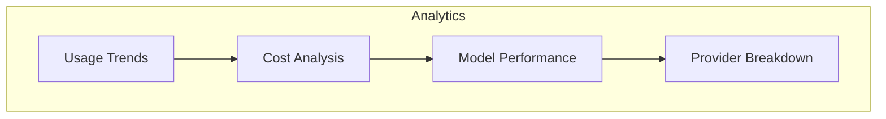

### 28.2 Usage Trends

| Metric | Visualization |
|--------|---------------|
| Token usage over time | Line chart |
| Input vs Output tokens | Stacked area |
| By provider | Multi-line |
| By model | Multi-line |
| By project | Multi-line |

### 28.3 Cost Analysis

| Metric | Visualization |
|--------|---------------|
| Cost over time | Line chart |
| By provider | Pie chart |
| By model | Bar chart |
| By project | Bar chart |
| Forecast | Trend line |

### 28.4 Model Performance

| Metric | Visualization |
|--------|---------------|
| Usage by model | Bar chart |
| Cost efficiency | Scatter plot |
| Token distribution | Histogram |

### 28.5 Analytics Time Ranges

| Range | Description |
|-------|-------------|
| 7 days | Last week |
| 30 days | Last month |
| 90 days | Last quarter |
| 1 year | Last year |
| Custom | User-defined range |

---

## 29. Search System

### 29.1 Search Architecture

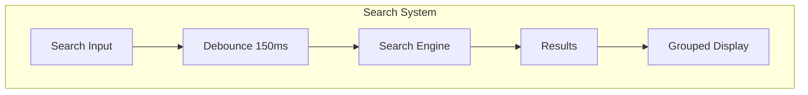

### 29.2 Search Features

| Feature | Description |
|---------|-------------|
| **Fuzzy Matching** | Tolerant of typos |
| **Multi-entity** | Searches across all entities |
| **Grouped Results** | Results grouped by entity type |
| **Highlighted Matches** | Matched text highlighted |
| **Keyboard Navigation** | Arrow keys + Enter |
| **Recent Searches** | Saved recent searches |
| **Saved Searches** | Persist search queries |

### 29.3 Search Implementation

```javascript
// Search engine
const searchEngine = {
  agents: (query) => agentRepository.search(query, ['name', 'description', 'system_prompt']),
  providers: (query) => providerRepository.search(query, ['name', 'description']),
  models: (query) => modelRepository.search(query, ['name', 'model_id', 'description']),
  accounts: (query) => accountRepository.search(query, ['email', 'name']),
  api_keys: (query) => apiKeyRepository.search(query, ['name', 'key_prefix']),
  projects: (query) => projectRepository.search(query, ['name', 'description']),
  notes: (query) => noteRepository.search(query, ['title', 'content']),
  tags: (query) => tagRepository.search(query, ['name']),
}

async function globalSearch(query) {
  const results = await Promise.all(
    Object.entries(searchEngine).map(async ([type, searchFn]) => {
      const items = await searchFn(query)
      return { type, items }
    })
  )

  return results.filter(r => r.items.length > 0)
}
```

---

## 30. Command Palette

### 30.1 Command Palette Features

| Feature | Description |
|---------|-------------|
| **Quick Navigation** | Jump to any page |
| **Entity Creation** | Create any entity |
| **Actions** | Run common actions |
| **Search** | Search across all entities |
| **Recent** | Recent commands |
| **Favorites** | Frequently used commands |

### 30.2 Command Categories

| Category | Commands |
|----------|----------|
| **Navigation** | Dashboard, Agents, Providers, Models, etc. |
| **Create** | New Agent, New Provider, New Model, etc. |
| **Actions** | Backup, Import, Export, Settings |
| **Search** | Global search, Entity search |
| **Recent** | Recently accessed entities |
| **Favorites** | User-favorited commands |

### 30.3 Command Palette Implementation

```javascript
// Command definitions
const commands = [
  {
    id: 'nav-dashboard',
    label: 'Go to Dashboard',
    category: 'Navigation',
    icon: LayoutDashboard,
    action: () => navigate('/'),
  },
  {
    id: 'nav-agents',
    label: 'Go to Agents',
    category: 'Navigation',
    icon: Bot,
    action: () => navigate('/agents'),
  },
  {
    id: 'create-agent',
    label: 'New Agent',
    category: 'Create',
    icon: Plus,
    shortcut: '⌘N',
    action: () => openDialog('agent-create'),
  },
  // ... more commands
]
```

### 30.4 Keyboard Shortcut

- **Open:** `Cmd+K` (Mac) / `Ctrl+K` (Windows/Linux)
- **Navigate:** Arrow keys
- **Select:** Enter
- **Close:** Escape

---

## 31. Navigation and Routing

### 31.1 Route Structure

```javascript
const routes = [
  { path: '/', component: Dashboard },
  { path: '/agents', component: Agents },
  { path: '/agents/:id', component: AgentDetail },
  { path: '/providers', component: Providers },
  { path: '/providers/:id', component: ProviderDetail },
  { path: '/models', component: Models },
  { path: '/models/:id', component: ModelDetail },
  { path: '/accounts', component: Accounts },
  { path: '/accounts/:id', component: AccountDetail },
  { path: '/api-keys', component: ApiKeys },
  { path: '/api-keys/:id', component: ApiKeyDetail },
  { path: '/projects', component: Projects },
  { path: '/projects/:id', component: ProjectDetail },
  { path: '/analytics', component: Analytics },
  { path: '/settings', component: Settings },
  { path: '/search', component: Search },
]
```

### 31.2 Navigation Components

| Component | Purpose |
|-----------|---------|
| **Sidebar** | Primary navigation |
| **Breadcrumbs** | Current location |
| **Back Button** | Return to previous page |
| **Command Palette** | Quick navigation |

### 31.3 Sidebar Navigation

| Section | Items |
|---------|-------|
| **Main** | Dashboard, Search |
| **Entities** | Agents, Providers, Models, Accounts, API Keys, Projects |
| **Organization** | Tags, Categories (v2.1) |
| **Analytics** | Usage, Cost Analysis |
| **System** | Settings, Backup |

---

## 32. State Management

### 32.1 State Architecture

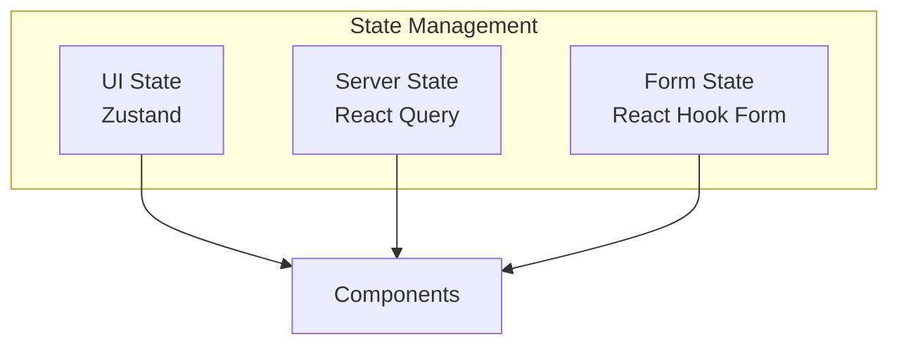

### 32.2 UI State (Zustand)

```javascript
// src/stores/sidebar-store.js
import { create } from 'zustand'

export const useSidebarStore = create((set) => ({
  collapsed: false,
  toggle: () => set((state) => ({ collapsed: !state.collapsed })),
  collapse: () => set({ collapsed: true }),
  expand: () => set({ collapsed: false }),
}))

// src/stores/command-palette-store.js
export const useCommandPaletteStore = create((set) => ({
  open: false,
  toggle: () => set((state) => ({ open: !state.open })),
  open: () => set({ open: true }),
  close: () => set({ open: false }),
}))
```

### 32.3 Server State (React Query)

```javascript
// Query keys
export const queryKeys = {
  agents: {
    all: ['agents'],
    detail: (id) => ['agents', id],
    search: (query) => ['agents', 'search', query],
  },
  providers: {
    all: ['providers'],
    detail: (id) => ['providers', id],
  },
  // ... more query keys
}

// Cache configuration
const queryClient = new QueryClient({
  defaultOptions: {
    queries: {
      staleTime: 5 * 60 * 1000, // 5 minutes
      cacheTime: 30 * 60 * 1000, // 30 minutes
      refetchOnWindowFocus: false,
    },
  },
})
```

---

## 33. Repositories

### 33.1 Repository Pattern

All repositories extend `BaseRepository` and follow a consistent pattern:

```javascript
// electron/repositories/agent_repository.cjs
const BaseRepository = require('./base_repository')

class AgentRepository extends BaseRepository {
  constructor(db) {
    super(db, 'agents')
  }

  list(filters = {}) {
    let sql = `
      SELECT a.*, 
        m.name as model_name,
        p.name as provider_name,
        pr.name as project_name
      FROM agents a
      LEFT JOIN models m ON a.model_id = m.id
      LEFT JOIN providers p ON m.provider_id = p.id
      LEFT JOIN projects pr ON a.project_id = pr.id
      WHERE a.deleted_at IS NULL
    `
    const params = []

    // Dynamic filtering
    if (filters.status) {
      sql += ` AND a.status = ?`
      params.push(filters.status)
    }
    if (filters.model_id) {
      sql += ` AND a.model_id = ?`
      params.push(filters.model_id)
    }
    if (filters.project_id) {
      sql += ` AND a.project_id = ?`
      params.push(filters.project_id)
    }
    if (filters.search) {
      sql += ` AND (a.name LIKE ? OR a.description LIKE ?)`
      params.push(`%${filters.search}%`, `%${filters.search}%`)
    }

    sql += ` ORDER BY a.created_at DESC`
    return this.db.prepare(sql).all(...params)
  }
}

module.exports = AgentRepository
```

### 33.2 Repository List

| Repository | Table | Purpose |
|------------|-------|---------|
| `AgentRepository` | agents | Agent CRUD |
| `ProviderRepository` | providers | Provider CRUD |
| `ModelRepository` | models | Model CRUD |
| `AccountRepository` | accounts | Account CRUD |
| `ApiKeyRepository` | api_keys | API Key CRUD |
| `ProjectRepository` | projects | Project CRUD |
| `NoteRepository` | notes | Note CRUD |
| `TagRepository` | tags | Tag CRUD |
| `UsageRepository` | usage_logs | Usage tracking |
| `ActivityRepository` | activity_history | Activity logging |
| `SettingsRepository` | settings | Settings storage |
| `BackupRepository` | - | Backup operations |
| `SearchRepository` | - | Search operations |
| `FavoritesRepository` | favorites | Favorites CRUD |
| `TemplateRepository` | templates | Templates CRUD |

---

## 34. Services

### 34.1 Service Architecture

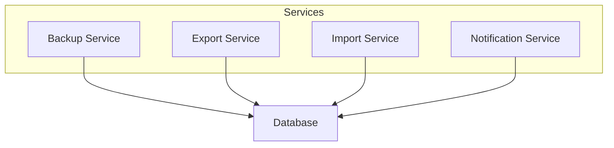

### 34.2 Backup Service

```javascript
// electron/services/backup_service.cjs
class BackupService {
  constructor(db, app) {
    this.db = db
    this.app = app
  }

  async createBackup(filePath) {
    // Copy database file to backup location
    const dbPath = this.db.name
    await fs.copyFile(dbPath, filePath)
    
    // Create metadata
    const metadata = {
      version: '2.0.0',
      created_at: new Date().toISOString(),
      tables: await this.getTableCounts(),
    }
    
    await fs.writeFile(
      filePath + '.meta.json',
      JSON.stringify(metadata, null, 2)
    )
    
    return { success: true, path: filePath }
  }

  async restoreBackup(filePath) {
    // Validate backup file
    const metadata = JSON.parse(
      await fs.readFile(filePath + '.meta.json', 'utf-8')
    )
    
    if (metadata.version !== '2.0.0') {
      throw new Error('Incompatible backup version')
    }
    
    // Create current backup before restore
    await this.createBackup(filePath + '.pre-restore')
    
    // Replace database
    const dbPath = this.db.name
    await fs.copyFile(filePath, dbPath)
    
    return { success: true }
  }
}
```

### 34.3 Export Service

| Format | Description |
|--------|-------------|
| `json` | Full database export |
| `csv` | Entity-specific CSV export |
| `markdown` | Formatted markdown export |

### 34.4 Import Service

| Format | Description |
|--------|-------------|
| `json` | Full database import |
| `csv` | Entity-specific CSV import |

### 34.5 Notification Service

| Type | Trigger |
|------|---------|
| `quota_reset` | Quota reset completed |
| `key_expiring` | API key expiring in 7 days |
| `key_expired` | API key expired |
| `backup_complete` | Backup completed |
| `import_complete` | Import completed |
| `migration_complete` | Schema migration completed |

---

## 35. Shared Hooks

### 35.1 Hook List

| Hook | Purpose | Dependencies |
|------|---------|--------------|
| `useAgents` | Agent CRUD operations | React Query |
| `useProviders` | Provider CRUD operations | React Query |
| `useModels` | Model CRUD operations | React Query |
| `useAccounts` | Account CRUD operations | React Query |
| `useApiKeys` | API Key CRUD operations | React Query |
| `useProjects` | Project CRUD operations | React Query |
| `useTags` | Tag CRUD operations | React Query |
| `useNotes` | Note CRUD operations | React Query |
| `useUsage` | Usage data operations | React Query |
| `useSettings` | Settings operations | React Query |
| `useSearch` | Global search | React Query |
| `useThemes` | Theme management | Zustand |

### 35.2 Hook Pattern

```javascript
// src/hooks/use-agents.js
import { useQuery, useMutation, useQueryClient } from '@tanstack/react-query'
import { api } from '../lib/ipc'

export function useAgents(filters) {
  const queryClient = useQueryClient()

  const query = useQuery({
    queryKey: ['agents', filters],
    queryFn: () => api.agents.list(filters),
  })

  const create = useMutation({
    mutationFn: (data) => api.agents.create(data),
    onSuccess: () => {
      queryClient.invalidateQueries({ queryKey: ['agents'] })
    },
  })

  const update = useMutation({
    mutationFn: ({ id, ...data }) => api.agents.update(id, data),
    onSuccess: () => {
      queryClient.invalidateQueries({ queryKey: ['agents'] })
    },
  })

  const remove = useMutation({
    mutationFn: (id) => api.agents.delete(id),
    onSuccess: () => {
      queryClient.invalidateQueries({ queryKey: ['agents'] })
    },
  })

  return {
    data: query.data,
    isLoading: query.isLoading,
    error: query.error,
    create,
    update,
    remove,
  }
}

export function useAgent(id) {
  const queryClient = useQueryClient()

  const query = useQuery({
    queryKey: ['agents', id],
    queryFn: () => api.agents.get(id),
    enabled: !!id,
  })

  const update = useMutation({
    mutationFn: (data) => api.agents.update(id, data),
    onSuccess: () => {
      queryClient.invalidateQueries({ queryKey: ['agents'] })
      queryClient.invalidateQueries({ queryKey: ['agents', id] })
    },
  })

  return {
    data: query.data,
    isLoading: query.isLoading,
    error: query.error,
    update,
  }
}
```

---

## 36. Shared Components

### 36.1 Component Inventory

| Category | Components |
|----------|------------|
| **Layout** | Layout, Sidebar, TitleBar, StatusBar |
| **Data Table** | DataTable, DataTableColumnHeader, DataTablePagination, DataTableToolbar, DataTableRowActions, DataTableEmpty, DataTableSkeleton |
| **Dialogs** | EntityDialog, ConfirmDialog, ExportDialog, ImportDialog, BackupDialog |
| **Shared** | EmptyState, ErrorState, LoadingState, PageHeader, SearchInput, FilterBar, BulkActions, SortableList, VirtualList |
| **Entity** | EntityHeader, EntityInfo, EntityMetadata, EntityActions, EntityTags |

### 36.2 Layout Components

#### Layout

```jsx
function Layout() {
  return (
    <div className="flex h-screen">
      <TitleBar />
      <Sidebar />
      <main className="flex-1 overflow-auto">
        <Outlet />
      </main>
      <StatusBar />
    </div>
  )
}
```

#### Sidebar

| Section | Items |
|---------|-------|
| **Logo** | App logo + name |
| **Navigation** | Entity links with icons |
| **Favorites** | Favorited items |
| **Recent** | Recently accessed |
| **Settings** | Settings link |

#### TitleBar

| Feature | Description |
|---------|-------------|
| **Draggable** | Drag to move window |
| **Window Controls** | Minimize, Maximize, Close |
| **Breadcrumb** | Current location |
| **Search** | Quick search |

#### StatusBar

| Info | Description |
|------|-------------|
| **Version** | App version |
| **DB Status** | Database connection status |
| **Backup** | Last backup time |
| **Notifications** | Notification count |

### 36.3 DataTable Components

#### DataTable

```jsx
function DataTable({ columns, data, onRowClick }) {
  const table = useReactTable({
    data,
    columns,
    getCoreRowModel: getCoreRowModel(),
    getSortedRowModel: getSortedRowModel(),
    getFilteredRowModel: getFilteredRowModel(),
    getPaginationRowModel: getPaginationRowModel(),
  })

  return (
    <div className="rounded-md border">
      <Table>
        <TableHeader>
          {table.getHeaderGroups().map((headerGroup) => (
            <TableRow key={headerGroup.id}>
              {headerGroup.headers.map((header) => (
                <TableHead key={header.id}>
                  <DataTableColumnHeader column={header.column} />
                </TableHead>
              ))}
            </TableRow>
          ))}
        </TableHeader>
        <TableBody>
          {table.getRowModel().rows.map((row) => (
            <TableRow
              key={row.id}
              onClick={() => onRowClick?.(row.original)}
              className="cursor-pointer"
            >
              {row.getVisibleCells().map((cell) => (
                <TableCell key={cell.id}>
                  {flexRender(cell.column.columnDef.cell, cell.getContext())}
                </TableCell>
              ))}
            </TableRow>
          ))}
        </TableBody>
      </Table>
    </div>
  )
}
```

### 36.4 EmptyState Component

```jsx
function EmptyState({ icon, title, description, action }) {
  return (
    <div className="flex flex-col items-center justify-center py-12">
      <div className="rounded-full bg-muted p-4">
        {icon && <Icon className="h-8 w-8 text-muted-foreground" />}
      </div>
      <h3 className="mt-4 text-lg font-semibold">{title}</h3>
      <p className="mt-2 text-sm text-muted-foreground text-center max-w-sm">
        {description}
      </p>
      {action && <div className="mt-4">{action}</div>}
    </div>
  )
}
```

### 36.5 PageHeader Component

```jsx
function PageHeader({ title, description, actions }) {
  return (
    <div className="flex items-center justify-between pb-4">
      <div>
        <h1 className="text-2xl font-bold">{title}</h1>
        {description && (
          <p className="text-muted-foreground">{description}</p>
        )}
      </div>
      {actions && <div className="flex gap-2">{actions}</div>}
    </div>
  )
}
```

---

## 37. Shared Tables

### 37.1 Table Patterns

All entity tables follow consistent patterns:

| Feature | Implementation |
|---------|---------------|
| **Sorting** | Click column header to sort |
| **Filtering** | Filter bar above table |
| **Search** | Search input in filter bar |
| **Pagination** | Page controls below table |
| **Bulk Select** | Checkbox column for multi-select |
| **Row Actions** | Dropdown menu per row |
| **Empty State** | Friendly empty state |
| **Loading State** | Skeleton loading |

### 37.2 Column Definitions

```javascript
export const agentColumns = [
  {
    id: 'select',
    header: ({ table }) => (
      <Checkbox
        checked={table.getIsAllPageRowsSelected()}
        onCheckedChange={(value) => table.toggleAllPageRowsSelected(!!value)}
      />
    ),
    cell: ({ row }) => (
      <Checkbox
        checked={row.getIsSelected()}
        onCheckedChange={(value) => row.toggleSelected(!!value)}
      />
    ),
    enableSorting: false,
    enableHiding: false,
  },
  {
    accessorKey: 'name',
    header: ({ column }) => <DataTableColumnHeader column={column} title="Name" />,
    cell: ({ row }) => (
      <div className="flex items-center gap-2">
        <Bot className="h-4 w-4 text-muted-foreground" />
        <span className="font-medium">{row.getValue('name')}</span>
      </div>
    ),
  },
  {
    accessorKey: 'model_name',
    header: ({ column }) => <DataTableColumnHeader column={column} title="Model" />,
  },
  {
    accessorKey: 'status',
    header: ({ column }) => <DataTableColumnHeader column={column} title="Status" />,
    cell: ({ row }) => (
      <Badge variant={row.getValue('status') === 'active' ? 'default' : 'secondary'}>
        {row.getValue('status')}
      </Badge>
    ),
  },
  {
    accessorKey: 'created_at',
    header: ({ column }) => <DataTableColumnHeader column={column} title="Created" />,
    cell: ({ row }) => format(new Date(row.getValue('created_at')), 'MMM d, yyyy'),
  },
  {
    id: 'actions',
    cell: ({ row }) => <DataTableRowActions row={row} />,
  },
]
```

---

## 38. Shared Dialogs

### 38.1 EntityDialog

```jsx
function EntityDialog({ type, entity, open, onClose }) {
  const { create, update } = useEntity(type)

  const handleSubmit = async (data) => {
    if (entity) {
      await update({ id: entity.id, ...data })
    } else {
      await create(data)
    }
    onClose()
  }

  return (
    <Dialog open={open} onOpenChange={onClose}>
      <DialogContent>
        <DialogHeader>
          <DialogTitle>
            {entity ? `Edit ${type}` : `New ${type}`}
          </DialogTitle>
        </DialogHeader>
        <EntityForm type={type} defaultValues={entity} onSubmit={handleSubmit} />
      </DialogContent>
    </Dialog>
  )
}
```

### 38.2 ConfirmDialog

```jsx
function ConfirmDialog({ open, onClose, onConfirm, title, description }) {
  return (
    <AlertDialog open={open} onOpenChange={onClose}>
      <AlertDialogContent>
        <AlertDialogHeader>
          <AlertDialogTitle>{title}</AlertDialogTitle>
          <AlertDialogDescription>{description}</AlertDialogDescription>
        </AlertDialogHeader>
        <AlertDialogFooter>
          <AlertDialogCancel>Cancel</AlertDialogCancel>
          <AlertDialogAction onClick={onConfirm}>Confirm</AlertDialogAction>
        </AlertDialogFooter>
      </AlertDialogContent>
    </AlertDialog>
  )
}
```

---

## 39. Widgets

| Widget | Description | Data Source |
|--------|-------------|-------------|
| `StatsWidget` | Key metrics | Dashboard API |
| `QuickActionsWidget` | Common actions | Static config |
| `UsageChartWidget` | Usage over time | Usage API |
| `RecentActivityWidget` | Latest actions | Activity API |
| `UpcomingResetsWidget` | Reset schedule | Quotas API |

---

## 40. Charts

| Chart | Library | Purpose |
|-------|---------|---------|
| Line Chart | Recharts | Usage trends |
| Area Chart | Recharts | Token usage |
| Bar Chart | Recharts | Cost breakdown |
| Pie Chart | Recharts | Provider distribution |

---

## 41. Theme System

| Mode | Description |
|------|-------------|
| `light` | Light theme |
| `dark` | Dark theme |
| `system` | Follows OS preference |

---

## 42. Design Tokens

### 42.1 Spacing Scale

| Token | Value |
|-------|-------|
| `--spacing-1` | 0.25rem (4px) |
| `--spacing-2` | 0.5rem (8px) |
| `--spacing-3` | 0.75rem (12px) |
| `--spacing-4` | 1rem (16px) |
| `--spacing-5` | 1.25rem (20px) |
| `--spacing-6` | 1.5rem (24px) |
| `--spacing-8` | 2rem (32px) |
| `--spacing-10` | 2.5rem (40px) |
| `--spacing-12` | 3rem (48px) |

### 42.2 Border Radius

| Token | Value |
|-------|-------|
| `--radius-sm` | 0.25rem (4px) |
| `--radius-md` | 0.375rem (6px) |
| `--radius-lg` | 0.5rem (8px) |
| `--radius-xl` | 0.75rem (12px) |

### 42.3 Typography

| Element | Size | Weight | Line Height |
|---------|------|--------|-------------|
| `h1` | 2.25rem | 700 | 1.2 |
| `h2` | 1.875rem | 700 | 1.3 |
| `h3` | 1.5rem | 600 | 1.3 |
| `body` | 1rem | 400 | 1.5 |
| `small` | 0.875rem | 400 | 1.5 |

---

## 43. Animations

### 43.1 Animation Library

Using `motion` (Framer Motion successor) for animations.

### 43.2 Animation Types

| Type | Use Case | Duration |
|------|----------|----------|
| **Page Transitions** | Route changes | 200ms |
| **Dialog Enter/Exit** | Modal open/close | 150ms |
| **Hover Effects** | Button/card hover | 100ms |
| **Loading States** | Skeleton shimmer | 1500ms loop |
| **List Animations** | Item add/remove | 200ms |
| **Drag** | Reorder lists | 200ms |

### 43.3 Animation Presets

```javascript
const animations = {
  fadeIn: {
    initial: { opacity: 0 },
    animate: { opacity: 1 },
    exit: { opacity: 0 },
    transition: { duration: 0.2 },
  },
  slideIn: {
    initial: { opacity: 0, y: 10 },
    animate: { opacity: 1, y: 0 },
    exit: { opacity: 0, y: -10 },
    transition: { duration: 0.2 },
  },
  scaleIn: {
    initial: { opacity: 0, scale: 0.95 },
    animate: { opacity: 1, scale: 1 },
    exit: { opacity: 0, scale: 0.95 },
    transition: { duration: 0.15 },
  },
}
```

---

## 44. Accessibility

### 44.1 WCAG 2.1 AA Requirements

| Requirement | Implementation |
|-------------|---------------|
| **Keyboard Navigation** | All interactive elements focusable |
| **Screen Readers** | ARIA labels, live regions |
| **Color Contrast** | 4.5:1 minimum ratio |
| **Focus Visible** | Visible focus indicators |
| **Semantic HTML** | Proper heading hierarchy |
| **Form Labels** | All inputs have labels |
| **Error Messages** | Associated with inputs |

### 44.2 Keyboard Shortcuts

| Shortcut | Action |
|----------|--------|
| `Tab` | Next focusable element |
| `Shift+Tab` | Previous focusable element |
| `Enter` | Activate button/link |
| `Space` | Toggle checkbox |
| `Escape` | Close dialog/dropdown |
| `Arrow keys` | Navigate within groups |
| `Cmd/Ctrl+K` | Open command palette |

### 44.3 ARIA Patterns

```jsx
// Dialog
<div role="dialog" aria-modal="true" aria-labelledby="dialog-title">
  <h2 id="dialog-title">Dialog Title</h2>
</div>

// Alert
<div role="alert" aria-live="assertive">
  Error message
</div>

// Navigation
<nav aria-label="Main navigation">
  <ul>...</ul>
</nav>

// Tab panel
<div role="tablist">
  <button role="tab" aria-selected={active}>Tab 1</button>
</div>
<div role="tabpanel">...</div>
```

---

## 45. Performance

### 45.1 Performance Budget

| Metric | Target |
|--------|--------|
| **Initial Load** | < 3 seconds |
| **Route Change** | < 500ms |
| **Search Results** | < 300ms |
| **Table Render (1000 rows)** | < 200ms |
| **DB Query (simple)** | < 50ms |
| **DB Query (complex)** | < 200ms |
| **Bundle Size** | < 2MB |

### 45.2 Optimization Strategies

| Strategy | Implementation |
|----------|---------------|
| **Virtualization** | TanStack Virtual for large lists |
| **Lazy Loading** | React.lazy for route components |
| **Memoization** | useMemo, useCallback for expensive computations |
| **Query Caching** | React Query staleTime configuration |
| **Prepared Statements** | Cached SQL statements |
| **Code Splitting** | Vite code splitting |
| **Tree Shaking** | Only import used functions |

### 45.3 Virtualization

```jsx
import { useVirtualizer } from '@tanstack/react-virtual'

function VirtualList({ items, renderItem }) {
  const parentRef = useRef(null)

  const virtualizer = useVirtualizer({
    count: items.length,
    getScrollElement: () => parentRef.current,
    estimateSize: () => 50,
    overscan: 5,
  })

  return (
    <div ref={parentRef} className="h-[400px] overflow-auto">
      <div
        style={{
          height: `${virtualizer.getTotalSize()}px`,
          width: '100%',
          position: 'relative',
        }}
      >
        {virtualizer.getVirtualItems().map((virtualRow) => (
          <div
            key={virtualRow.key}
            style={{
              position: 'absolute',
              top: 0,
              left: 0,
              width: '100%',
              height: `${virtualRow.size}px`,
              transform: `translateY(${virtualRow.start}px)`,
            }}
          >
            {renderItem(items[virtualRow.index])}
          </div>
        ))}
      </div>
    </div>
  )
}
```

---

## 46. Security

### 46.1 Security Measures

| Measure | Implementation |
|---------|---------------|
| **API Key Storage** | SHA-256 hashing |
| **Input Validation** | Zod schemas on all inputs |
| **SQL Injection** | Parameterized queries only |
| **XSS Prevention** | React's built-in escaping |
| **CSP** | Content Security Policy headers |
| **Permissions** | Electron permission restrictions |

### 46.2 API Key Security

```javascript
const crypto = require('crypto')

function hashApiKey(key) {
  return crypto.createHash('sha256').update(key).digest('hex')
}

function getApiKeyPrefix(key) {
  return key.substring(0, 8)
}
```

### 46.3 Input Validation

```javascript
// All IPC handlers validate input
ipcMain.handle('agents:create', async (event, data) => {
  const validated = AgentCreateSchema.parse(data)
  // ... proceed with validated data
})
```

### 46.4 SQL Injection Prevention

```javascript
// ALWAYS use parameterized queries
const sql = 'SELECT * FROM agents WHERE id = ?'
const agent = db.prepare(sql).get(id)

// NEVER concatenate user input
// BAD: `SELECT * FROM agents WHERE name = '${name}'`
```

---

## 47. SQLite Optimization

### 47.1 PRAGMA Configuration

| PRAGMA | Value | Purpose |
|--------|-------|---------|
| `journal_mode` | WAL | Write-ahead logging |
| `busy_timeout` | 5000 | Lock timeout |
| `synchronous` | NORMAL | Sync mode |
| `cache_size` | -64000 | 64MB cache |
| `page_size` | 4096 | Page size |
| `mmap_size` | 268435456 | 256MB mmap |
| `foreign_keys` | ON | Referential integrity |

### 47.2 Indexing Strategy

| Table | Index | Columns |
|-------|-------|---------|
| agents | idx_agents_status | status |
| agents | idx_agents_model | model_id |
| agents | idx_agents_project | project_id |
| models | idx_models_provider | provider_id |
| accounts | idx_accounts_provider | provider_id |
| api_keys | idx_api_keys_provider | provider_id |
| api_keys | idx_api_keys_expires | expires_at |
| usage_logs | idx_usage_model | model_id |
| usage_logs | idx_usage_project | project_id |
| usage_logs | idx_usage_timestamp | timestamp |
| activity_history | idx_activity_entity | entity_type, entity_id |
| entity_tags | idx_entity_tags_entity | entity_type, entity_id |

### 47.3 Query Optimization Tips

1. **Use indexes:** Always filter by indexed columns when possible
2. **Limit results:** Use LIMIT for large result sets
3. **Select only needed columns:** Avoid SELECT *
4. **Use transactions:** Batch inserts in transactions
5. **Cache prepared statements:** Reuse frequently used queries
6. **Analyze tables:** Run ANALYZE periodically

---

## 48. Keyboard Shortcuts

### 48.1 Global Shortcuts

| Shortcut | Action | Scope |
|----------|--------|-------|
| `Cmd/Ctrl+K` | Command Palette | Global |
| `Cmd/Ctrl+N` | New Entity | Global |
| `Cmd/Ctrl+S` | Save | Global |
| `Cmd/Ctrl+Z` | Undo | Global |
| `Cmd/Ctrl+Shift+Z` | Redo | Global |
| `Cmd/Ctrl+F` | Search | Global |
| `Cmd/Ctrl+/` | Help | Global |

### 48.2 Navigation Shortcuts

| Shortcut | Action |
|----------|--------|
| `Cmd/Ctrl+1` | Dashboard |
| `Cmd/Ctrl+2` | Agents |
| `Cmd/Ctrl+3` | Providers |
| `Cmd/Ctrl+4` | Models |
| `Cmd/Ctrl+5` | Accounts |
| `Cmd/Ctrl+6` | API Keys |
| `Cmd/Ctrl+7` | Projects |
| `Cmd/Ctrl+,` | Settings |

### 48.3 List Shortcuts

| Shortcut | Action |
|----------|--------|
| `Arrow Up` | Previous item |
| `Arrow Down` | Next item |
| `Enter` | Open item |
| `Delete` | Delete selected |
| `Space` | Toggle selection |
| `Shift+Click` | Range select |

### 48.4 Shortcut Implementation

```javascript
// src/hooks/use-keyboard-shortcuts.js
import { useEffect } from 'react'
import { useCommandPaletteStore } from '../stores/command-palette-store'

export function useKeyboardShortcuts() {
  const { toggle: toggleCommandPalette } = useCommandPaletteStore()

  useEffect(() => {
    const handler = (e) => {
      // Cmd/Ctrl + K
      if ((e.metaKey || e.ctrlKey) && e.key === 'k') {
        e.preventDefault()
        toggleCommandPalette()
      }
      // Cmd/Ctrl + N
      if ((e.metaKey || e.ctrlKey) && e.key === 'n') {
        e.preventDefault()
        // Open new entity dialog
      }
    }

    window.addEventListener('keydown', handler)
    return () => window.removeEventListener('keydown', handler)
  }, [toggleCommandPalette])
}
```

---

## 49. Import and Export

### 49.1 Export Formats

| Format | Content | Use Case |
|--------|---------|----------|
| **JSON** | Full database | Backup, migration |
| **CSV** | Entity-specific | Spreadsheet analysis |
| **Markdown** | Formatted text | Documentation |

### 49.2 JSON Export Structure

```javascript
{
  "version": "2.0.0",
  "exported_at": "2026-09-09T10:00:00Z",
  "data": {
    "providers": [...],
    "models": [...],
    "accounts": [...],
    "api_keys": [...],
    "agents": [...],
    "projects": [...],
    "tags": [...],
    "notes": [...],
    "usage_logs": [...],
    "activity_history": [...],
    "settings": {...}
  }
}
```

### 49.3 CSV Export

```javascript
function exportToCsv(data, columns) {
  const headers = columns.map(c => c.label).join(',')
  const rows = data.map(row =>
    columns.map(c => {
      const value = row[c.key]
      if (typeof value === 'string' && value.includes(',')) {
        return `"${value}"`
      }
      return value ?? ''
    }).join(',')
  )
  return [headers, ...rows].join('\n')
}
```

### 49.4 Import Validation

1. **File format check:** JSON/CSV validation
2. **Schema validation:** Zod schema for import data
3. **Duplicate detection:** Check for existing records
4. **Conflict resolution:** Skip, overwrite, or merge
5. **Progress reporting:** Emit progress events

---

## 50. Backup and Restore

### 50.1 Backup Strategy

| Type | Description | Frequency |
|------|-------------|-----------|
| **Manual** | User-initiated | On demand |
| **Automatic** | Scheduled backup | Daily/Weekly |
| **Pre-migration** | Before schema update | Automatic |
| **Pre-restore** | Before restore operation | Automatic |

### 50.2 Backup Location

```
%APPDATA%/ai-resource-manager/backups/
├── backup_2026-09-09_10-00-00.db
├── backup_2026-09-09_10-00-00.db.meta.json
├── backup_2026-09-10_10-00-00.db
├── backup_2026-09-10_10-00-00.db.meta.json
└── ...
```

### 50.3 Backup Metadata

```json
{
  "version": "2.0.0",
  "created_at": "2026-09-09T10:00:00Z",
  "tables": {
    "providers": 5,
    "models": 15,
    "accounts": 3,
    "api_keys": 7,
    "agents": 12,
    "projects": 4
  }
}
```

### 50.4 Restore Process

1. **Validate backup:** Check version and integrity
2. **Create pre-restore backup:** Safety net
3. **Close database connections**
4. **Replace database file**
5. **Reopen database connections**
6. **Run migrations if needed**
7. **Notify user of completion**

### 50.5 Auto-Backup Settings

| Setting | Default | Description |
|---------|---------|-------------|
| `backup.auto` | true | Enable auto-backup |
| `backup.interval` | daily | Backup frequency |
| `backup.retention` | 30 | Days to keep backups |
| `backup.path` | %APPDATA%/ai-resource-manager/backups | Backup location |

---

## 51. Notifications

### 51.1 Notification Types

| Type | Trigger | Severity |
|------|---------|----------|
| `quota_reset` | Quota reset completed | Info |
| `key_expiring` | API key expiring in 7 days | Warning |
| `key_expired` | API key expired | Error |
| `backup_complete` | Backup completed | Success |
| `import_complete` | Import completed | Success |
| `migration_complete` | Schema migration completed | Info |

### 51.2 Notification UI

```jsx
function NotificationItem({ notification }) {
  return (
    <div className="flex items-start gap-3 p-4">
      <NotificationIcon type={notification.type} />
      <div className="flex-1">
        <p className="font-medium">{notification.title}</p>
        <p className="text-sm text-muted-foreground">{notification.message}</p>
      </div>
      <Button
        variant="ghost"
        size="sm"
        onClick={() => markAsRead(notification.id)}
      >
        <Check className="h-4 w-4" />
      </Button>
    </div>
  )
}
```

### 51.3 Notification Badge

```jsx
function NotificationBadge({ count }) {
  if (count === 0) return null
  return (
    <span className="absolute -top-1 -right-1 h-4 w-4 rounded-full bg-destructive text-xs text-white flex items-center justify-center">
      {count > 99 ? '99+' : count}
    </span>
  )
}
```

---

## 52. Settings

### 52.1 Settings Categories

| Category | Settings |
|----------|----------|
| **Appearance** | Theme, Sidebar, Font size |
| **Data** | Auto-backup, Retention, Export |
| **Notifications** | Enable/disable, Sound |
| **Keyboard** | Shortcuts, Key bindings |
| **About** | Version, License, Credits |

### 52.2 Settings Storage

```javascript
// Settings structure in database
{
  key: 'theme.mode',
  value: '"system"',
  updated_at: '2026-09-09T10:00:00Z'
}
```

### 52.3 Default Settings

| Key | Default | Description |
|-----|---------|-------------|
| `theme.mode` | system | Theme mode |
| `sidebar.collapsed` | false | Sidebar state |
| `sidebar.width` | 240 | Sidebar width |
| `backup.auto` | true | Auto-backup enabled |
| `backup.interval` | daily | Backup frequency |
| `backup.retention` | 30 | Days to keep |
| `notifications.enabled` | true | Notifications on |
| `notifications.sound` | true | Sound enabled |

### 52.4 Settings Page

```jsx
function SettingsPage() {
  return (
    <div className="space-y-6">
      <PageHeader title="Settings" />
      
      <Tabs defaultValue="appearance">
        <TabsList>
          <TabsTrigger value="appearance">Appearance</TabsTrigger>
          <TabsTrigger value="data">Data</TabsTrigger>
          <TabsTrigger value="notifications">Notifications</TabsTrigger>
          <TabsTrigger value="about">About</TabsTrigger>
        </TabsList>
        
        <TabsContent value="appearance">
          <AppearanceSettings />
        </TabsContent>
        <TabsContent value="data">
          <DataSettings />
        </TabsContent>
        <TabsContent value="notifications">
          <NotificationSettings />
        </TabsContent>
        <TabsContent value="about">
          <AboutSettings />
        </TabsContent>
      </Tabs>
    </div>
  )
}
```

---

## 53. Optional Modules

### 53.1 Module Overview

Optional modules are plug-in style features that can be enabled/disabled:

| Module | Description | Default |
|--------|-------------|---------|
| **Providers** | AI provider management | Enabled |
| **API Keys** | API key management | Enabled |
| **Projects** | Project organization | Enabled |
| **Skills** | Agent skill management | Disabled (v2.2) |
| **MCP Servers** | MCP server management | Disabled (v2.2) |
| **Tags** | Tagging system | Enabled |
| **Categories** | Category organization | Disabled (v2.1) |

### 53.2 Module Configuration

```javascript
// electron/lib/constants.cjs
const MODULES = {
  providers: {
    name: 'Providers',
    enabled: true,
    entity: 'provider',
  },
  api_keys: {
    name: 'API Keys',
    enabled: true,
    entity: 'api_key',
  },
  projects: {
    name: 'Projects',
    enabled: true,
    entity: 'project',
  },
  skills: {
    name: 'Skills',
    enabled: false,
    entity: 'skill',
    minVersion: '2.2',
  },
  mcp_servers: {
    name: 'MCP Servers',
    enabled: false,
    entity: 'mcp_server',
    minVersion: '2.2',
  },
  tags: {
    name: 'Tags',
    enabled: true,
    entity: 'tag',
  },
  categories: {
    name: 'Categories',
    enabled: false,
    entity: 'category',
    minVersion: '2.1',
  },
}
```

### 53.3 Dynamic Navigation

```jsx
function Sidebar() {
  const { modules } = useModules()
  
  return (
    <nav>
      {Object.entries(modules)
        .filter(([_, config]) => config.enabled)
        .map(([key, config]) => (
          <NavLink key={key} to={`/${config.entity}s`}>
            {config.name}
          </NavLink>
        ))}
    </nav>
  )
}
```

---

## 54. Productivity Features

### 54.1 Features Overview

| Feature | Description |
|---------|-------------|
| **Quick Actions** | One-click common actions |
| **Favorites** | Pin frequently used items |
| **Recent** | Recently accessed items |
| **Templates** | Reusable entity templates |
| **Bulk Operations** | Multi-select actions |
| **Keyboard Navigation** | Full keyboard support |
| **Global Search** | Search across all entities |
| **Command Palette** | Quick access to all actions |
| **Undo/Redo** | Undo/redo last action (v2.1) |

### 54.2 Favorites System

```javascript
// Add to favorites
async function addToFavorites(entityType, entityId) {
  await api.favorites.create({ entity_type: entityType, entity_id: entityId })
}

// Get favorites
async function getFavorites() {
  return await api.favorites.list()
}
```

### 54.3 Templates System

```javascript
// Create template from entity
async function createTemplate(name, entityType, entityData) {
  return await api.templates.create({
    name,
    entity_type: entityType,
    config: JSON.stringify(entityData),
  })
}

// Create entity from template
async function createFromTemplate(templateId) {
  const template = await api.templates.get(templateId)
  const config = JSON.parse(template.config)
  return await api[template.entity_type].create(config)
}
```

---

## 55. Coding Standards

### 55.1 JavaScript/JSX Standards

| Standard | Description |
|----------|-------------|
| **Format** | Prettier |
| **Lint** | ESLint |
| **Naming** | camelCase variables, PascalCase components |
| **File Naming** | kebab-case files, PascalCase components |
| **Imports** | Absolute imports with `@/` prefix |
| **Components** | Functional components with hooks |
| **State** | Zustand for UI, React Query for server |

### 55.2 File Naming Conventions

| Type | Convention | Example |
|------|------------|---------|
| **Components** | kebab-case | `agent-list.jsx` |
| **Hooks** | kebab-case with `use-` | `use-agents.js` |
| **Services** | kebab-case with `-service` | `backup-service.cjs` |
| **Repositories** | kebab-case with `-repository` | `agent-repository.cjs` |
| **IPC** | kebab-case with `.ipc` | `agents.ipc.cjs` |
| **Utilities** | kebab-case | `utils.js` |

### 55.3 Code Organization

```javascript
// 1. Imports
import React from 'react'
import { useQuery } from '@tanstack/react-query'
import { api } from '../lib/ipc'
import { Button } from '../components/ui/button'

// 2. Constants
const PAGE_SIZE = 20

// 3. Component
function AgentList() {
  // 4. Hooks
  const { data, isLoading } = useQuery(...)
  
  // 5. Handlers
  const handleCreate = () => {}
  
  // 6. Render
  return (
    <div>
      {/* ... */}
    </div>
  )
}

// 7. Export
export default AgentList
```

---

## 56. Testing Strategy

### 56.1 Testing Pyramid

```
         /\
        /  \  E2E Tests (Cypress/Playwright)
       /----\
      /      \  Integration Tests (Vitest)
     /--------\
    /          \  Unit Tests (Vitest)
   /------------\
```

### 56.2 Test Types

| Type | Scope | Tools | Coverage |
|------|-------|-------|----------|
| **Unit** | Individual functions | Vitest | 80%+ |
| **Integration** | Component + hooks | Vitest + Testing Library | 70%+ |
| **E2E** | Full workflows | Cypress/Playwright | Critical paths |

### 56.3 Test Categories

| Category | Description |
|----------|-------------|
| **Repository Tests** | Database operations |
| **IPC Handler Tests** | IPC message handling |
| **Hook Tests** | React Query hooks |
| **Component Tests** | UI component rendering |
| **Integration Tests** | Multi-component flows |
| **E2E Tests** | User workflows |

### 56.4 Test File Naming

```
tests/
  unit/
    repositories/
      agent_repository.test.cjs
    hooks/
      use-agents.test.js
  integration/
    ipc-handlers/
      agents.test.cjs
  e2e/
    workflows/
      agent_management.cy.js
```

---

## 57. Migration Strategy

### 57.1 Migration Approach

| Phase | Approach |
|-------|----------|
| **v1 → v2** | Fresh start (new database) |
| **v2.x → v2.y** | Incremental migrations |
| **Data Import** | JSON/CSV import from v1 |

### 57.2 Migration Files

```
electron/database/migrations/
├── 20260909120000_initial_schema.sql
├── 20260909120001_seed_data.sql
├── 20260910120000_add_quotas.sql
└── 20260911120000_add_favorites.sql
```

### 57.3 Migration Naming Convention

```
YYYYMMDDHHMMSS_description.sql
```

---

## 58. Development Phases

### 58.1 Phase Overview

| Phase | Duration | Focus |
|-------|----------|-------|
| **Phase 1** | 2 weeks | Foundation + Core Entities |
| **Phase 2** | 2 weeks | CRUD + Search |
| **Phase 3** | 2 weeks | Dashboard + Analytics |
| **Phase 4** | 1 week | Polish + Performance |
| **Phase 5** | 1 week | Testing + Documentation |

### 58.2 Phase 1: Foundation

- [ ] Project setup (Electron + Vite + React)
- [ ] Database connection + migrations
- [ ] Base repository class
- [ ] IPC infrastructure
- [ ] Preload script
- [ ] Layout components
- [ ] Theme system
- [ ] Navigation

### 58.3 Phase 2: Core Entities

- [ ] Providers (CRUD)
- [ ] Models (CRUD)
- [ ] Accounts (CRUD)
- [ ] API Keys (CRUD)
- [ ] Agents (CRUD)
- [ ] Projects (CRUD)
- [ ] Tags (CRUD)
- [ ] Notes (CRUD)

### 58.4 Phase 3: Search + Dashboard

- [ ] Search system
- [ ] Command palette
- [ ] Dashboard widgets
- [ ] Activity history
- [ ] Quota tracking

### 58.5 Phase 4: Polish

- [ ] Animations
- [ ] Keyboard shortcuts
- [ ] Accessibility
- [ ] Performance optimization
- [ ] Error handling

### 58.6 Phase 5: Testing

- [ ] Unit tests
- [ ] Integration tests
- [ ] E2E tests
- [ ] Documentation

---

## 59. Implementation Roadmap

### 59.1 Week 1-2: Foundation

| Day | Task |
|-----|------|
| 1-2 | Project setup, Electron configuration |
| 3-4 | Database schema, migrations |
| 5-6 | Base repository, IPC infrastructure |
| 7-8 | Preload script, IPC client |
| 9-10 | Layout components, navigation |

### 59.2 Week 3-4: Core Entities

| Day | Task |
|-----|------|
| 11-12 | Providers, Models |
| 13-14 | Accounts, API Keys |
| 15-16 | Agents, Projects |
| 17-18 | Tags, Notes |
| 19-20 | Generic CRUD system |

### 59.3 Week 5-6: Search + Dashboard

| Day | Task |
|-----|------|
| 21-22 | Search system |
| 23-24 | Command palette |
| 25-26 | Dashboard widgets |
| 27-28 | Activity history |
| 29-30 | Quota tracking |

### 59.4 Week 7-8: Polish + Testing

| Day | Task |
|-----|------|
| 31-32 | Animations, keyboard shortcuts |
| 33-34 | Accessibility, performance |
| 35-36 | Unit tests |
| 37-38 | Integration tests |
| 39-40 | E2E tests, documentation |

---

## 60. Future Roadmap

### 60.1 v2.1 Features

| Feature | Description |
|---------|-------------|
| **Categories** | Category organization |
| **Undo/Redo** | Undo/redo support |
| **Advanced Analytics** | More charts and insights |
| **Keyboard Customization** | Custom shortcuts |
| **Markdown Editor** | Rich note editing |
| **File Attachments** | Note attachments |

### 60.2 v2.2 Features

| Feature | Description |
|---------|-------------|
| **Skills Management** | Agent skill management |
| **MCP Server Support** | MCP server management |
| **Agent Templates** | Pre-configured agent templates |
| **Usage Alerts** | Custom usage alerts |
| **Data Sync** | Optional cloud sync |
| **API Integration** | Provider API integration |

### 60.3 v3.0 Vision

| Feature | Description |
|---------|-------------|
| **Multi-user** | Team support |
| **Cloud Sync** | Cloud backup/sync |
| **Marketplace** | Agent/skill marketplace |
| **Analytics Pro** | Advanced analytics |
| **Mobile Companion** | Mobile app |

---

## 61. Risk Assessment

### 61.1 Technical Risks

| Risk | Impact | Likelihood | Mitigation |
|------|--------|------------|------------|
| **Database corruption** | High | Low | Regular backups, WAL mode |
| **Performance issues** | Medium | Medium | Virtualization, caching |
| **Electron limitations** | Low | Medium | Follow best practices |
| **Migration failures** | High | Low | Pre-migration backups |
| **Data loss** | High | Low | Multiple backup strategies |

### 61.2 Project Risks

| Risk | Impact | Likelihood | Mitigation |
|------|--------|------------|------------|
| **Scope creep** | High | High | Strict phase boundaries |
| **Technical debt** | Medium | Medium | Code review, testing |
| **Dependency issues** | Medium | Low | Pin versions, alternatives |
| **Time overrun** | Medium | Medium | Buffer time, prioritization |

---

## 62. Developer Experience

### 62.1 Development Tools

| Tool | Purpose |
|------|---------|
| **Vite** | Fast dev server |
| **ESLint** | Code linting |
| **Prettier** | Code formatting |
| **Vitest** | Unit testing |
| **Git** | Version control |

### 62.2 Development Commands

| Command | Description |
|---------|-------------|
| `npm run dev` | Start dev server |
| `npm run build` | Build for production |
| `npm run test` | Run tests |
| `npm run lint` | Lint code |
| `npm run format` | Format code |

### 62.3 Debugging

| Tool | Purpose |
|------|---------|
| **DevTools** | React DevTools |
| **Electron DevTools** | Main process debugging |
| **VS Code** | IDE integration |
| **Console** | Logging |

---

## 63. Acceptance Criteria

### 63.1 Functional Criteria

| ID | Criteria |
|----|----------|
| AC-01 | User can create, read, update, delete all entities |
| AC-02 | User can search across all entities |
| AC-03 | User can use command palette for quick actions |
| AC-04 | User can backup and restore database |
| AC-05 | User can import and export data |
| AC-06 | User can customize theme |
| AC-07 | User can use keyboard for all actions |
| AC-08 | User can track quotas and usage |

### 63.2 Non-Functional Criteria

| ID | Criteria |
|----|----------|
| NFC-01 | App starts in < 3 seconds |
| NFC-02 | Search results in < 300ms |
| NFC-03 | Table renders 1000 rows in < 200ms |
| NFC-04 | Zero hardcoded values |
| NFC-05 | WCAG 2.1 AA compliance |
| NFC-06 | 80%+ test coverage |

---

## 64. Final Checklist

### 64.1 Pre-Launch Checklist

- [ ] All P0 features implemented
- [ ] All P1 features implemented
- [ ] Unit tests passing
- [ ] Integration tests passing
- [ ] E2E tests passing
- [ ] Performance targets met
- [ ] Accessibility audit passed
- [ ] Security audit passed
- [ ] Documentation complete
- [ ] Backup/restore tested
- [ ] Import/export tested
- [ ] Cross-platform tested
- [ ] Error handling verified
- [ ] Logging implemented
- [ ] Seed data working

### 64.2 Release Criteria

| Criteria | Status |
|----------|--------|
| All acceptance criteria met | |
| No critical bugs | |
| No P1 bugs | |
| Test coverage > 80% | |
| Performance targets met | |
| Documentation complete | |

---

## 65. Appendices

### 65.1 Appendix A: Database Schema SQL

```sql
-- Initial schema migration
CREATE TABLE providers (
  id INTEGER PRIMARY KEY AUTOINCREMENT,
  name TEXT NOT NULL,
  slug TEXT NOT NULL UNIQUE,
  website TEXT,
  logo_url TEXT,
  description TEXT,
  color TEXT,
  is_active INTEGER NOT NULL DEFAULT 1,
  sort_order INTEGER NOT NULL DEFAULT 0,
  created_at TEXT NOT NULL DEFAULT (datetime('now')),
  updated_at TEXT NOT NULL DEFAULT (datetime('now')),
  deleted_at TEXT
);

CREATE TABLE models (
  id INTEGER PRIMARY KEY AUTOINCREMENT,
  provider_id INTEGER NOT NULL,
  name TEXT NOT NULL,
  slug TEXT NOT NULL,
  model_id TEXT NOT NULL,
  description TEXT,
  context_window INTEGER,
  max_output INTEGER,
  cost_per_1k_input REAL,
  cost_per_1k_output REAL,
  is_active INTEGER NOT NULL DEFAULT 1,
  created_at TEXT NOT NULL DEFAULT (datetime('now')),
  updated_at TEXT NOT NULL DEFAULT (datetime('now')),
  deleted_at TEXT,
  FOREIGN KEY (provider_id) REFERENCES providers(id)
);

CREATE TABLE accounts (
  id INTEGER PRIMARY KEY AUTOINCREMENT,
  provider_id INTEGER NOT NULL,
  email TEXT NOT NULL,
  name TEXT,
  plan_type TEXT,
  status TEXT NOT NULL DEFAULT 'active',
  notes TEXT,
  created_at TEXT NOT NULL DEFAULT (datetime('now')),
  updated_at TEXT NOT NULL DEFAULT (datetime('now')),
  deleted_at TEXT,
  FOREIGN KEY (provider_id) REFERENCES providers(id)
);

CREATE TABLE api_keys (
  id INTEGER PRIMARY KEY AUTOINCREMENT,
  account_id INTEGER,
  provider_id INTEGER NOT NULL,
  name TEXT NOT NULL,
  key_prefix TEXT NOT NULL,
  key_hash TEXT NOT NULL,
  scopes TEXT,
  expires_at TEXT,
  is_active INTEGER NOT NULL DEFAULT 1,
  last_used_at TEXT,
  created_at TEXT NOT NULL DEFAULT (datetime('now')),
  updated_at TEXT NOT NULL DEFAULT (datetime('now')),
  deleted_at TEXT,
  FOREIGN KEY (account_id) REFERENCES accounts(id),
  FOREIGN KEY (provider_id) REFERENCES providers(id)
);

CREATE TABLE agents (
  id INTEGER PRIMARY KEY AUTOINCREMENT,
  name TEXT NOT NULL,
  description TEXT,
  model_id INTEGER,
  account_id INTEGER,
  project_id INTEGER,
  system_prompt TEXT,
  temperature REAL,
  max_tokens INTEGER,
  status TEXT NOT NULL DEFAULT 'active',
  created_at TEXT NOT NULL DEFAULT (datetime('now')),
  updated_at TEXT NOT NULL DEFAULT (datetime('now')),
  deleted_at TEXT,
  FOREIGN KEY (model_id) REFERENCES models(id),
  FOREIGN KEY (account_id) REFERENCES accounts(id),
  FOREIGN KEY (project_id) REFERENCES projects(id)
);

CREATE TABLE projects (
  id INTEGER PRIMARY KEY AUTOINCREMENT,
  name TEXT NOT NULL,
  description TEXT,
  status TEXT NOT NULL DEFAULT 'active',
  color TEXT,
  sort_order INTEGER NOT NULL DEFAULT 0,
  created_at TEXT NOT NULL DEFAULT (datetime('now')),
  updated_at TEXT NOT NULL DEFAULT (datetime('now')),
  deleted_at TEXT
);

CREATE TABLE tags (
  id INTEGER PRIMARY KEY AUTOINCREMENT,
  name TEXT NOT NULL UNIQUE,
  color TEXT,
  created_at TEXT NOT NULL DEFAULT (datetime('now'))
);

CREATE TABLE entity_tags (
  id INTEGER PRIMARY KEY AUTOINCREMENT,
  entity_type TEXT NOT NULL,
  entity_id INTEGER NOT NULL,
  tag_id INTEGER NOT NULL,
  created_at TEXT NOT NULL DEFAULT (datetime('now')),
  FOREIGN KEY (tag_id) REFERENCES tags(id),
  UNIQUE(entity_type, entity_id, tag_id)
);

CREATE TABLE notes (
  id INTEGER PRIMARY KEY AUTOINCREMENT,
  entity_type TEXT NOT NULL,
  entity_id INTEGER NOT NULL,
  title TEXT,
  content TEXT,
  created_at TEXT NOT NULL DEFAULT (datetime('now')),
  updated_at TEXT NOT NULL DEFAULT (datetime('now'))
);

CREATE TABLE usage_logs (
  id INTEGER PRIMARY KEY AUTOINCREMENT,
  model_id INTEGER,
  project_id INTEGER,
  agent_id INTEGER,
  account_id INTEGER,
  input_tokens INTEGER,
  output_tokens INTEGER,
  cost REAL,
  model_name TEXT,
  timestamp TEXT NOT NULL,
  created_at TEXT NOT NULL DEFAULT (datetime('now')),
  FOREIGN KEY (model_id) REFERENCES models(id),
  FOREIGN KEY (project_id) REFERENCES projects(id),
  FOREIGN KEY (agent_id) REFERENCES agents(id),
  FOREIGN KEY (account_id) REFERENCES accounts(id)
);

CREATE TABLE activity_history (
  id INTEGER PRIMARY KEY AUTOINCREMENT,
  entity_type TEXT NOT NULL,
  entity_id INTEGER NOT NULL,
  action TEXT NOT NULL,
  details TEXT,
  created_at TEXT NOT NULL DEFAULT (datetime('now'))
);

CREATE TABLE settings (
  key TEXT PRIMARY KEY,
  value TEXT,
  updated_at TEXT NOT NULL DEFAULT (datetime('now'))
);

CREATE TABLE quotas (
  id INTEGER PRIMARY KEY AUTOINCREMENT,
  entity_type TEXT NOT NULL,
  entity_id INTEGER NOT NULL,
  quota_type TEXT NOT NULL,
  limit_value REAL NOT NULL,
  current_value REAL NOT NULL DEFAULT 0,
  reset_interval TEXT,
  reset_day INTEGER,
  last_reset TEXT,
  next_reset TEXT,
  created_at TEXT NOT NULL DEFAULT (datetime('now')),
  updated_at TEXT NOT NULL DEFAULT (datetime('now'))
);

CREATE TABLE favorites (
  id INTEGER PRIMARY KEY AUTOINCREMENT,
  entity_type TEXT NOT NULL,
  entity_id INTEGER NOT NULL,
  sort_order INTEGER NOT NULL DEFAULT 0,
  created_at TEXT NOT NULL DEFAULT (datetime('now')),
  UNIQUE(entity_type, entity_id)
);

CREATE TABLE templates (
  id INTEGER PRIMARY KEY AUTOINCREMENT,
  name TEXT NOT NULL,
  entity_type TEXT NOT NULL,
  config TEXT NOT NULL,
  is_default INTEGER NOT NULL DEFAULT 0,
  created_at TEXT NOT NULL DEFAULT (datetime('now')),
  updated_at TEXT NOT NULL DEFAULT (datetime('now'))
);

CREATE TABLE saved_searches (
  id INTEGER PRIMARY KEY AUTOINCREMENT,
  name TEXT NOT NULL,
  query TEXT NOT NULL,
  filters TEXT,
  entity_type TEXT,
  created_at TEXT NOT NULL DEFAULT (datetime('now'))
);

CREATE TABLE notifications (
  id INTEGER PRIMARY KEY AUTOINCREMENT,
  type TEXT NOT NULL,
  title TEXT NOT NULL,
  message TEXT,
  entity_type TEXT,
  entity_id INTEGER,
  is_read INTEGER NOT NULL DEFAULT 0,
  created_at TEXT NOT NULL DEFAULT (datetime('now'))
);

CREATE TABLE schema_migrations (
  version INTEGER PRIMARY KEY,
  name TEXT NOT NULL,
  applied_at TEXT NOT NULL DEFAULT (datetime('now'))
);

CREATE TABLE agent_skills (
  id INTEGER PRIMARY KEY AUTOINCREMENT,
  agent_id INTEGER NOT NULL,
  skill_id INTEGER NOT NULL,
  created_at TEXT NOT NULL DEFAULT (datetime('now')),
  FOREIGN KEY (agent_id) REFERENCES agents(id),
  FOREIGN KEY (skill_id) REFERENCES skills(id),
  UNIQUE(agent_id, skill_id)
);

CREATE TABLE agent_mcp_servers (
  id INTEGER PRIMARY KEY AUTOINCREMENT,
  agent_id INTEGER NOT NULL,
  mcp_server_id INTEGER NOT NULL,
  created_at TEXT NOT NULL DEFAULT (datetime('now')),
  FOREIGN KEY (agent_id) REFERENCES agents(id),
  FOREIGN KEY (mcp_server_id) REFERENCES mcp_servers(id),
  UNIQUE(agent_id, mcp_server_id)
);

-- Indexes
CREATE INDEX idx_models_provider ON models(provider_id);
CREATE INDEX idx_accounts_provider ON accounts(provider_id);
CREATE INDEX idx_api_keys_provider ON api_keys(provider_id);
CREATE INDEX idx_api_keys_account ON api_keys(account_id);
CREATE INDEX idx_agents_model ON agents(model_id);
CREATE INDEX idx_agents_account ON agents(account_id);
CREATE INDEX idx_agents_project ON agents(project_id);
CREATE INDEX idx_agents_status ON agents(status);
CREATE INDEX idx_entity_tags_entity ON entity_tags(entity_type, entity_id);
CREATE INDEX idx_entity_tags_tag ON entity_tags(tag_id);
CREATE INDEX idx_notes_entity ON notes(entity_type, entity_id);
CREATE INDEX idx_usage_model ON usage_logs(model_id);
CREATE INDEX idx_usage_project ON usage_logs(project_id);
CREATE INDEX idx_usage_agent ON usage_logs(agent_id);
CREATE INDEX idx_usage_account ON usage_logs(account_id);
CREATE INDEX idx_usage_timestamp ON usage_logs(timestamp);
CREATE INDEX idx_activity_entity ON activity_history(entity_type, entity_id);
CREATE INDEX idx_activity_created ON activity_history(created_at);
CREATE INDEX idx_quotas_entity ON quotas(entity_type, entity_id);
CREATE INDEX idx_favorites_entity ON favorites(entity_type, entity_id);
CREATE INDEX idx_notifications_read ON notifications(is_read);
CREATE INDEX idx_notifications_created ON notifications(created_at);
```

### 65.2 Appendix B: IPC API Reference

| Namespace | Methods |
|-----------|---------|
| `agents` | list, get, create, update, delete |
| `providers` | list, get, create, update, delete |
| `models` | list, get, create, update, delete |
| `accounts` | list, get, create, update, delete |
| `api_keys` | list, get, create, update, delete |
| `projects` | list, get, create, update, delete |
| `notes` | list, get, create, update, delete |
| `tags` | list, get, create, update, delete |
| `usage` | list, get, create, getStats |
| `activity` | list, get, create |
| `settings` | get, set, getAll |
| `db` | backup, restore, export, import |
| `app` | version, path |
| `window` | minimize, maximize, close |
| `search` | global, entity |
| `favorites` | list, create, delete |
| `templates` | list, get, create, update, delete |

### 65.3 Appendix C: Error Codes

| Code | Description |
|------|-------------|
| `DB_CONNECTION` | Database connection failed |
| `DB_MIGRATION` | Migration failed |
| `DB_CONSTRAINT` | Constraint violation |
| `IPC_TIMEOUT` | IPC call timed out |
| `IPC_ERROR` | IPC handler error |
| `VALIDATION_ERROR` | Input validation failed |
| `NOT_FOUND` | Entity not found |
| `DUPLICATE` | Duplicate entity |
| `PERMISSION` | Permission denied |
| `BACKUP_FAILED` | Backup operation failed |
| `IMPORT_FAILED` | Import operation failed |
| `EXPORT_FAILED` | Export operation failed |

### 65.4 Appendix D: Version History

| Version | Date | Changes |
|---------|------|---------|
| 1.0.0 | 2025-01-01 | Initial release |
| 1.1.0 | 2025-03-15 | Added search |
| 1.2.0 | 2025-06-01 | Added backup |
| 2.0.0 | 2026-09-01 | Complete rewrite |

### 65.5 Appendix E: Glossary

| Term | Definition |
|------|------------|
| **Entity** | A data object (Agent, Provider, etc.) |
| **CRUD** | Create, Read, Update, Delete |
| **IPC** | Inter-Process Communication |
| **WAL** | Write-Ahead Logging |
| **PRAGMA** | SQLite configuration command |
| **Soft Delete** | Mark as deleted without removing |
| **Migration** | Schema version upgrade |
| **Repository** | Data access layer |
| **Query Key** | React Query cache identifier |

---

*End of Document.*